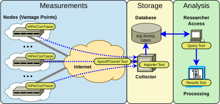

<p align="center">
 <a href="https://www.nntb.no/~dreibh/hipercontracer/">
 <br />
 https://www.nntb.no/~dreibh/hipercontracer/
 </a>
</p>

# What is High-Performance Connectivity Tracer&nbsp;(HiPerConTracer)?

High-Performance Connectivity Tracer&nbsp;(HiPerConTracer) is a Ping/Traceroute measurement framework.

[HiPerConTracer](#running-a-hipercontracer-measurement) denotes the actual measurement tool. It performs regular Ping and Traceroute runs among sites, featuring:

- multi-transport-protocol support (ICMP, UDP);
- multi-homing and parallelism support;
- handling of load balancing in the network;
- multi-platform support (currently Linux and FreeBSD);
- [high-precision (nanoseconds) timing support (Linux timestamping, both software and hardware)](https://www.nntb.no/~dreibh/hipercontracer/#Publications-SoftCOM2023-Timestamping);
- a library (shared/static) to integrate measurement functionality into other software (libhipercontracer);
- open source and written in a performance- and portability-focused programming language (C++) with only limited dependencies.

Furthermore, the HiPerConTracer Framework provides additional tools for helping to obtain, process, collect, store, and retrieve measurement data:

* [HiPerConTracer Viewer Tool](#the-hipercontracer-viewer-tool) for displaying the contents of results files;
* [HiPerConTracer Results Tool](#the-hipercontracer-results-tool) for merging and converting results files, e.g.&nbsp;to create a Comma-Separated Value&nbsp;(CSV) file;
* [HiPerConTracer Sync Tool](#the-hipercontracer-sync-tool) for copying data from a measurement node (vantage point) to a remote HiPerConTracer Collector server (via [RSync](https://rsync.samba.org/)/[SSH](https://www.openssh.com/));
* [HiPerConTracer Reverse Tunnel Tool](#the-hipercontracer-reverse-tunnel-tool) for maintaining a reverse [SSH](https://www.openssh.com/) tunnel from a remote measurement node to a HiPerConTracer Collector server;
* [HiPerConTracer Collector/Node Tools](#the-hipercontracer-collectornode-tools) for simplifying the setup of HiPerConTracer Nodes and a HiPerConTracer Collector server;
* [HiPerConTracer Trigger Tool](#the-hipercontracer-trigger-tool) for triggering HiPerConTracer measurements in the reverse direction;
* [HiPerConTracer Importer Tool](#the-hipercontracer-importer-tool) for storing measurement data from results files into SQL or NoSQL databases. Currently, database backends for [MariaDB](https://mariadb.com/)/[MySQL](https://www.mysql.com/), [PostgreSQL](https://www.postgresql.org/) and [MongoDB](https://www.mongodb.com/) are provided;
* [HiPerConTracer Query Tool](#the-hipercontracer-query-tool) for querying data from a database and storing it into a results file;
* [HiPerConTracer Database Shell](#the-hipercontracer-database-shell) as simple command-line front-end for the underlying database backends;
* [HiPerConTracer Database Tools](#the-hipercontracer-database-tools) with some helper scripts to e.g.&nbsp;to join HiPerConTracer database configurations into an existing [DBeaver](https://dbeaver.io/) (a popular SQL database GUI application) configuration;
* [HiPerConTracer UDP Echo Server](#the-hipercontracer-udp-echo-server) as UDP Echo ([RFC&nbsp;862](https://datatracker.ietf.org/doc/html/rfc862)) protocol endpoint;
* [Wireshark Dissector for HiPerConTracer Packets](#wireshark-dissector-for-hipercontracer-packets)

<p align="center">
 
</p>


# Installation

## Binary Package Installation

Please use the issue tracker at [https://github.com/dreibh/hipercontracer/issues](https://github.com/dreibh/hipercontracer/issues) to report bugs and issues!

### Ubuntu Linux

For ready-to-install Ubuntu Linux packages of HiPerConTracer, see [Launchpad PPA for Thomas Dreibholz](https://launchpad.net/~dreibh/+archive/ubuntu/ppa/+packages?field.name_filter=hipercontracer&field.status_filter=published&field.series_filter=)!

```
sudo apt-add-repository -sy ppa:dreibh/ppa
sudo apt-get update
sudo apt-get install hipercontracer
```

### Fedora Linux

For ready-to-install Fedora Linux packages of HiPerConTracer, see [COPR PPA for Thomas Dreibholz](https://copr.fedorainfracloud.org/coprs/dreibh/ppa/package/hipercontracer/)!

```
sudo dnf copr enable -y dreibh/ppa
sudo dnf install hipercontracer
```

### FreeBSD

For ready-to-install FreeBSD packages of HiPerConTracer, it is included in the ports collection, see [FreeBSD ports tree index of benchmarks/hipercontracer/](https://cgit.freebsd.org/ports/tree/benchmarks/hipercontracer/)!

```
pkg install hipercontracer
```

Alternatively, to compile it from the ports sources:

```
cd /usr/ports/benchmarks/hipercontracer
make
make install
```

## Sources Download

HiPerConTracer is released under the GNU General Public Licence (GPL).

Please use the issue tracker at [https://github.com/dreibh/hipercontracer/issues](https://github.com/dreibh/hipercontracer/issues) to report bugs and issues!

### Development Version

The Git repository of the HiPerConTracer sources can be found at [https://github.com/dreibh/hipercontracer](https://github.com/dreibh/hipercontracer):

```
git clone https://github.com/dreibh/hipercontracer
cd hipercontracer
cmake .
make
```

Contributions:

- Issue tracker: [https://github.com/dreibh/hipercontracer/issues](https://github.com/dreibh/hipercontracer/issues).
  Please submit bug reports, issues, questions, etc. in the issue tracker!

- Pull Requests for HiPerConTracer: [https://github.com/dreibh/hipercontracer/pulls](https://github.com/dreibh/hipercontracer/pulls).
  Your contributions to HiPerConTracer are always welcome!

- CI build tests of HiPerConTracer: [https://github.com/dreibh/hipercontracer/actions](https://github.com/dreibh/hipercontracer/actions).

- Coverity Scan analysis of HiPerConTracer: [https://scan.coverity.com/projects/dreibh-hipercontracer](https://scan.coverity.com/projects/dreibh-hipercontracer).

### Current Stable Release

See [https://www.nntb.no/~dreibh/hipercontracer/#StableRelease](https://www.nntb.no/~dreibh/hipercontracer/#StableRelease)!


# Recommended Directory Structure and File Permissions

In the simple case, HiPerConTracer can just be used as a measurement tool without creating special directory setups; to be described in [Running a HiPerConTracer Measurement](#running-a-hipercontracer-measurement).

For a larger setup, particularly consisting of measurement nodes and/or database import, it is recommended to properly set up storage directories. As current best practises for using the HiPerConTracer framework securely, the following directory structure and file permissions are recommended:

## Users

* hipercontracer:
  Unprivileged user to run [HiPerConTracer](#running-a-hipercontracer-measurement) or one of the framework tools.
* node<1-9999>:
  Unprivileged user on a [HiPerConTracer Collector](#the-hipercontracer-collectornode-tools), to store the data collected by a remote [HiPerConTracer Node](#the-hipercontracer-collectornode-tools).

## Groups

* node<1-9999>: A group for each node user.
* hpct-nodes: A group to provide read access to the data stored on a Collector. User hipercontracer should be a member of this group, but <b>not</b> the node<1-9999> users!

## Directories and Permissions

* /var/hipercontracer (ownership: hipercontracer:hipercontracer; permissions: 755 = rwxr-xr-x)

   * /var/hipercontracer/data (ownership: hipercontracer:hpct-nodes; permissions: 755 = rwxr-xr-x)

     Storage for data recorded by [HiPerConTracer](#running-a-hipercontracer-measurement).

   * /var/hipercontracer/data/node<1-9999>: (ownership: node<1-9999>:hpct-nodes; permissions: 755 = rwxr-xr-x)

     Storage for data transferred from a remote Node using the [HiPerConTracer Sync Tool](#the-hipercontracer-sync-tool). Each of these node directories corresponds to a Node.

     Data is stored as node<1-9999>:node<1-9999>. The permissions only allow the user itself to modify files in its own directory. A node<1-9999> user is <b>not</b> able to modify data of another node<1-9999> user!

   * /var/hipercontracer/good (ownership: hipercontracer:hpct-nodes; permissions: 755 = rwxr-xr-x)

     Storage for data that was successfully imported into a database by using the [HiPerConTracer Importer Tool](#the-hipercontracer-importer-tool). The Importer moves the data from /var/hipercontracer/data after import.

   * /var/hipercontracer/bad (ownership: hipercontracer:hpct-nodes; permissions: 755 = rwxr-xr-x)

     Storage for data that was not successfully imported into a database by using the [HiPerConTracer Importer Tool](#the-hipercontracer-importer-tool). The Importer moves the data from /var/hipercontracer/data after import failure.

   * /etc/hipercontracer/ssh (ownership: hipercontracer:hipercontracer; permissions: 700 = rwx------)

     Storage for the SSH private/public key pair, as well as the known_hosts file, on a [HiPerConTracer Node](#the-hipercontracer-collectornode-tools), to be used by [HiPerConTracer Sync Tool](#the-hipercontracer-sync-tool) and [HiPerConTracer Reverse Tunnel Tool](#the-hipercontracer-reverse-tunnel-tool).

   That is:

   ```
   sudo mkdir -p -m 755 /var/hipercontracer
   sudo chown hipercontracer:hipercontracer /var/hipercontracer
   for subDirectory in data good bad ; do
      sudo mkdir -p -m 755 /var/hipercontracer/$subDirectory
      sudo chown hipercontracer:hpct-nodes /var/hipercontracer/$subDirectory
   done
   sudo mkdir -p -m 700 /var/hipercontracer/ssh
   sudo chown hipercontracer:hipercontracer /var/hipercontracer/ssh
   ```

* /etc/hipercontracer (ownership: root:root; permissions: 755 = rwx------)

  Configuration files, e.g. for importer or database.

## Access Control Lists (ACL)

* /var/hipercontracer/data, /var/hipercontracer/good, and /var/hipercontracer/bad:

   These directories must be <b>writable</b> for the [HiPerConTracer Importer Tool](#the-hipercontracer-importer-tool), to allow it moving files owned by node<1-9999>:hpct-nodes without superuser permissions, as well as <b>readable</b> for members of the group hpct-nodes, for reading the node status files:
   * Linux (POSIX ACLs):
     ```
     sudo setfacl -Rm d:u:hipercontracer:rwx,u:hipercontracer:rwx,d:g:hpct-nodes:rx,g:hpct-nodes:rx \
        /var/hipercontracer/data /var/hipercontracer/good /var/hipercontracer/bad
     ```
   * FreeBSD (NFSv4 ACLs):
     ```
     sudo setfacl -Rm u:hipercontracer:modify_set:file_inherit/dir_inherit:allow,g:hpct-nodes:read_set:file_inherit/dir_inherit:allow \
        /var/hipercontracer/data /var/hipercontracer/good /var/hipercontracer/bad
     ```


# Running a HiPerConTracer Measurement

HiPerConTracer is the measurement tool itself.

## Example 1
A simple Ping run, without data storage, from arbitrary local addresses, to all IPv4 and IPv6 addresses of [www.heise.de](https://www.heise.de) (resolved by DNS) via ICMP (default):
```
sudo hipercontracer --destination www.heise.de --ping --verbose
```

## Example 2
Run HiPerConTracer measurement #1000000, from arbitrary local IPv4 address to destination 193.99.144.80, using Traceroute and Ping. Store data into sub-directory "data" in the current directory; run as current user $USER:
```
sudo hipercontracer \
   --user $USER -#1000000 \
   --source 0.0.0.0 --destination 193.99.144.80 \
   --traceroute --ping \
   --resultsdirectory data \
   --verbose
```
Notes:

- Run HiPerConTracer as a non-privileged user ("\-\-user" option). HiPerConTracer only needs superuser permissions to create the raw sockets.
- HiPerConTracer uses the sub-directory "data" (provided by "\-\-resultsdirectory") to write the results files to. This directory must be writable for the user $USER!
- See the [manpage of "hipercontracer"](https://github.com/dreibh/hipercontracer/blob/master/src/hipercontracer.1) for various options to set Ping and Traceroute intervals, results file lengths, results file compression, etc.!

## Example 3
Run HiPerConTracer measurement #1000001, from arbitrary local IPv4 (0.0.0.0) and IPv6 (::) addresses to destinations 193.99.144.80 and 2a02:2e0:3fe:1001:302:: with Traceroute and Ping via ICMP (default). Store results files into sub-directory "data" in the current directory; run as current user $USER:
```
sudo hipercontracer \
   --user $USER \
   -#1000001 \
   --source 0.0.0.0 --source :: \
   --destination 193.99.144.80 --destination 2a02:2e0:3fe:1001:302:: \
   --traceroute --ping \
   --resultsdirectory data \
   --verbose
```

## Results File Examples

Some simple results file examples (from [src/results-examples](https://github.com/dreibh/hipercontracer/tree/master/src/results-examples)):

- [HiPerConTracer ICMP Ping over IPv4](https://github.com/dreibh/hipercontracer/blob/master/src/results-examples/Ping-ICMP-%231000001-0.0.0.0-20241219T090830.364329-000000001.hpct)
- [HiPerConTracer ICMP Ping over IPv6](https://github.com/dreibh/hipercontracer/blob/master/src/results-examples/Ping-ICMP-%231000001-%3A%3A-20241219T090830.364464-000000001.hpct)
- [HiPerConTracer ICMP Traceroute over IPv4](https://github.com/dreibh/hipercontracer/blob/master/src/results-examples/Traceroute-ICMP-%231000001-0.0.0.0-20241219T090830.364422-000000001.hpct)
- [HiPerConTracer ICMP Traceroute over IPv6](https://github.com/dreibh/hipercontracer/blob/master/src/results-examples/Traceroute-ICMP-%231000001-%3A%3A-20241219T090830.364515-000000001.hpct)

Notes:

- See the [manpage of "hipercontracer"](https://github.com/dreibh/hipercontracer/blob/master/src/hipercontracer.1) for a detailed description of the results file formats: ```man hipercontracer```
- The HiPerConTracer Viewer Tool can be used to display results files, including uncompressed ones.
- The HiPerConTracer Results Tool can be used to merge and/or convert the results files.

## Further Details
See the [manpage of "hipercontracer"](https://github.com/dreibh/hipercontracer/blob/master/src/hipercontracer.1) for all options, including a description of the results file formats:
```
man hipercontracer
```


# The HiPerConTracer Viewer Tool

The HiPerConTracer Viewer Tool displays the contents of a results file.

## Example
```
hpct-viewer src/results-examples/Traceroute-UDP-#88888888-fdb6:6d27:be73:4::50-20231018T102656.821891-000000001.results.xz
```

## Further Details
See the [manpage of "hpct-viewer"](https://github.com/dreibh/hipercontracer/blob/master/src/hpct-viewer.1) for a detailed description of the available options:
```
man hpct-viewer
```


# The HiPerConTracer Results Tool

The HiPerConTracer Results Tool provides merging and converting data from results files, e.g.&nbsp;to create a Comma-Separated Value&nbsp;(CSV) file.

## Example 1
Merge the data from all files matching the pattern "Ping\*.hpct.\*" into CSV file "ping.csv.gz", with "," as separator:
```
find data -maxdepth 1 -name "Ping*.hpct.*" | \
   hpct-results --input-file-names-from-stdin --separator=, -o ping.csv.gz
```
Hint: You can use the extension .gz for GZip, .bz for BZip2, .xz for XZ, or none for uncompressed output into the output CSV file!

## Example 2
Merge the data from all files matching the pattern "Traceroute\*.hpct.\*" into CSV file "traceroute.csv.xz", with ";" as separator:
```
find data -maxdepth 1 -name "Traceroute*.hpct.*" | \
   hpct-results --input-file-names-from-stdin --separator=; -o traceroute.csv.xz
```

## Processing Results from a CSV File

See [src/results-examples](https://github.com/dreibh/hipercontracer/blob/master/src/results-examples) for some examples.

### GNU R

See [src/results-examples/r-install-dependencies](https://github.com/dreibh/hipercontracer/blob/master/src/results-examples/r-install-dependencies) to get the necessary library packages installed!

- [r-ping-example](https://github.com/dreibh/hipercontracer/blob/master/src/results-examples/r-ping-example) ping.csv
- [r-traceroute-example](https://github.com/dreibh/hipercontracer/blob/master/src/results-examples/r-traceroute-example) traceroute.csv.gz

### LibreOffice (or any similar spreadsheet program)

Import CSV file into spreadsheet.

Hints:

- Use English (US) language, to avoid strange number conversions.
- Choose column separator (" ", ",", etc.), if not automatically detected.

## Further Details
See the [manpage of "hpct-results"](https://github.com/dreibh/hipercontracer/blob/master/src/hpct-results.1) for a detailed description of the available options:
```
man hpct-results
```


# Setting Up a Database for Results Collection

See [src/SQL](https://github.com/dreibh/hipercontracer/tree/master/src/SQL) and [src/NoSQL](https://github.com/dreibh/hipercontracer/tree/master/src/NoSQL) for schema, user and permission setups. Create the database of your choice ([MariaDB](https://mariadb.com/)/[MySQL](https://www.mysql.com/), [PostgreSQL](https://www.postgresql.org/), or [MongoDB](https://www.mongodb.com/)).

Use separate users for importer (import access only), researcher (read-only access to the data) and maintainer (full access), for improved security.

Hint: The HiPerConTracer tools support Transport Layer Security&nbsp;(TLS) configuration. It is **strongly** recommended to properly setup TLS for secure access to a database!

See [src/TestDB](https://github.com/dreibh/hipercontracer/tree/master/src/TestDB) as example. This is the CI test, which includes a full database setup and test cycle with all supported database backends. Of course, this setup also includes proper TLS setup as well.


# The HiPerConTracer Importer Tool

The HiPerConTracer Importer Tool provides the continuous storage of collected measurement data from results files into SQL or NoSQL databases. Currently, database backends for [MariaDB](https://mariadb.com/)/[MySQL](https://www.mysql.com/), [PostgreSQL](https://www.postgresql.org/) and [MongoDB](https://www.mongodb.com/) are provided.

## Write Configuration Files for the Importer

See [src/hipercontracer-importer.conf](src/hipercontracer-importer.conf) (importer configuration) and [src/hipercontracer-database.conf](src/hipercontracer-database.conf) (database configuration) for examples. Make sure that the database access details are correct, so that Importer Tool and Query Tool can connect to the right database and has the required permissions! See [src/SQL](https://github.com/dreibh/hipercontracer/tree/master/src/SQL) and [src/NoSQL](https://github.com/dreibh/hipercontracer/tree/master/src/NoSQL) for schema, user and permission setups. Use the [HiPerConTracer Database Shell](#the-hipercontracer-database-shell) tool to verify and debug access.

Note: Make sure the "data" directory, as well as the directory for "good" imports and the directory for "bad" (i.e. failed) imports are existing and accessible by the user running the importer!

## Run the Importer Tool

### Example 1
Just run one import round, quit when there are no more files to import:
```
hpct-importer \
   --importer-config hipercontracer-importer.conf \
   --database-config hipercontracer-database.conf \
   --verbose \
   --quit-when-idle
```

### Example 2
Continuously run, waiting for new files to import:
```
hpct-importer \
   --importer-config hipercontracer-importer.conf \
   --database-config hipercontracer-database.conf \
   --verbose
```

Note: If running without "--quit-when-idle" (recommended), the importer keeps running and imports new files as soon as they appear in the results directory. The importer uses [INotify](https://en.wikipedia.org/wiki/Inotify)!

## Further Details
See the [manpage of "hpct-importer"](https://github.com/dreibh/hipercontracer/blob/master/src/hpct-importer.1) for a detailed description of the available options:
```
man hpct-importer
```


# The HiPerConTracer Query Tool

## Write a Configuration File for the Query Tool

See [src/hipercontracer-database.conf](src/hipercontracer-database.conf) for an example. Make sure that the database access details are correct, so that the Query tool can connect to the right database and has the required permissions! See [src/SQL](https://github.com/dreibh/hipercontracer/tree/master/src/SQL) and [src/NoSQL](https://github.com/dreibh/hipercontracer/tree/master/src/NoSQL) for schema, user and permission setups. Use the [HiPerConTracer Database Shell](#the-hipercontracer-database-shell) tool to verify and debug access.

## Run the Query Tool

### Example 1
Export all Ping data to ping.hpct.gz (GZip-compressed data file):
```
hpct-query ~/testdb-users-mariadb-researcher.conf ping -o ping.hpct.gz
```

Notes:

- Make sure to specify a Measurement ID range, or a time range. Otherwise, the Query tool will export **everything**!
- The output is in the same format as the originally written HiPerConTracer results. See the [manpage of "hipercontracer"](https://github.com/dreibh/hipercontracer/blob/master/src/hipercontracer.1) for all options, including a description of the results file formats: ```man hipercontracer```
- You can use the extension .gz for GZip, .bz for BZip2, .xz for XZ, or none for uncompressed output!

### Example 2
Export all Ping data of Measurement ID #1000 to ping.hpct.gz (GZip-compressed data file):
```
hpct-query ~/testdb-users-mariadb-researcher.conf \
   ping -o ping.hpct.gz \
   --from-measurement-id 1000 --to-measurement-id 1000
```

### Example 3
Export all Traceroute data of Measurement ID #1000 to traceroute.hpct.bz2 (BZip2-compressed data file), with verbose logging:
```
hpct-query ~/testdb-users-mariadb-researcher.conf \
   traceroute -o traceroute.hpct.bz2 --loglevel 0 \
   --from-measurement-id 1000 --to-measurement-id 1000
```

### Example 4
Export all Traceroute data from 2023-09-22 00:00:00 to traceroute.hpct.xz (XZ-compressed data file), with verbose logging:
```
hpct-query ~/testdb-users-mariadb-researcher.conf \
   traceroute -o traceroute.hpct.xz --verbose \
   --from-time "2023-09-22 00:00:00"
```

### Example 5
Export all Traceroute data from time interval [2023-09-22 00:00:00, 2023-09-23 00:00:00) to traceroute.hpct.xz (XZ-compressed data file):
```
hpct-query ~/testdb-users-mariadb-researcher.conf \
   traceroute -o traceroute.hpct.xz --verbose \
   --from-time "2023-09-22 00:00:00" --to-time "2023-09-23 00:00:00"
```
Note: data for time stamp 2023-09-23 00:00:00 will **not** be included, only data for time stamps **less than** 2023-09-23 00:00:00, i.e.&nbsp;data within the time interval [to-time, from-time). This ensures the possibility to e.g.&nbsp;export daily batches without having the same value included in two files!

## Further Details
See the [manpage of "hpct-query"](https://github.com/dreibh/hipercontracer/blob/master/src/hpct-query.1) for a detailed description of the available options:
```
man hpct-query
```


# The HiPerConTracer Sync Tool

The HiPerConTracer Sync Tool helps synchronising collected results files from a vantage point (denoted as HiPerConTracer Node) to a collection server (denoted as HiPerConTracer Collector), using [RSync](https://rsync.samba.org/)/[SSH](https://www.openssh.com/).

For information about the necessary underlying directory structure and file permissions, see
[Recommended Directory Structure and File Permissions](#recommended-directory-structure-and-file-permissions). In case of problems, a misconfiguration of these is the most likely issue!

## Example
Synchronise results files, with the following settings:

- local node is Node 1000;
- run as user "hipercontracer";
- from local directory /var/hipercontracer;
- to remote server's directory /var/hipercontracer (here, the data is going to be stored in sub-directory "1000");
- remote server is sognsvann.domain.example (must be a resolvable hostname);
- private key for logging into the remote server via SSH is in /var/hipercontracer/ssh/id_ed25519;
- known_hosts file for SSH is /var/hipercontracer/ssh/known_hosts;
- run with verbose output
```
sudo -u hipercontracer hpct-sync \
   --nodeid 1000 \
   --collector sognsvann.domain.example \
   --local /var/hipercontracer --remote /var/hipercontracer \
   --key /var/hipercontracer/ssh/id_ed25519 \
   --known-hosts /var/hipercontracer/ssh/known_hosts --verbose
```

## Further Details
See the [manpage of "hpct-sync"](https://github.com/dreibh/hipercontracer/blob/master/src/hpct-sync.1) for a detailed description of the available options:
```
man hpct-sync
```


# The HiPerConTracer Reverse Tunnel Tool

The HiPerConTracer Reverse Tunnel (RTunnel) Tool maintains a reverse [SSH](https://www.openssh.com/) tunnel from a remote HiPerConTracer Node to a HiPerConTracer Collector server. The purpose is to allow for SSH login from the Collector server to the Node, via this reverse tunnel. Then, the Node does not need a publicly-reachable IP address (e.g.&nbsp;a Node only having a private IP address behind a NAT/PAT firewall).

For information about the necessary underlying directory structure and file permissions, see
[Recommended Directory Structure and File Permissions](#recommended-directory-structure-and-file-permissions). In case of problems, a misconfiguration of these is the most likely issue!

## Example
Establish a Reverse Tunnel, with the following settings:

- local node is Node 1000;
- run as user "hipercontracer";
- connect to Collector server 10.44.35.16;
- using SSH private key from /var/hipercontracer/ssh/id_ed25519;
- with SSH known_hosts file /var/hipercontracer/ssh/known_hosts
```
sudo -u hipercontracer hpct-rtunnel \
   --nodeid 1000 --collector 10.44.35.16 \
   --key /var/hipercontracer/ssh/id_ed25519 \
   --known-hosts /var/hipercontracer/ssh/known_hosts
```

On the Collector, to connect to Node 1000:
```
hpct-ssh <user>@1000
```

## Further Details
See the [manpage of "hpct-rtunnel"](https://github.com/dreibh/hipercontracer/blob/master/src/hpct-rtunnel.1) for a detailed description of the available options for hpct-rtunnel:
```
man hpct-rtunnel
```

Also see the [manpage of "hpct-ssh"](https://github.com/dreibh/hipercontracer/blob/master/src/hpct-ssh.1) for a detailed description of the available options for hpct-ssh:
```
man hpct-ssh
```


# The HiPerConTracer Collector/Node Tools

The HiPerConTracer Collector/Node Tools are some scripts for simplifying the setup of Nodes and a Collector server. Mainly, they ensure the creation of Node configurations on the Collector, and corresponding setup of HiPerConTracer Sync Tool and HiPerConTracer Reverse Tunnel.

- [hpct-node-setup](https://github.com/dreibh/hipercontracer/blob/master/src/hpct-node-setup) (on a Node): Connect the node to a Collector.
- [hpct-nodes-list](https://github.com/dreibh/hipercontracer/blob/master/src/hpct-nodes-list) (on the Collector): List connected nodes, together with status information about last data synchronisation and reverse tunnel setup.
- [hpct-node-removal](https://github.com/dreibh/hipercontracer/blob/master/src/hpct-node-removal) (on the Collector): Remove a node from the Collector.

See the manpages of these tools for further details!

For information about the necessary underlying directory structure and file permissions, see
[Recommended Directory Structure and File Permissions](#recommended-directory-structure-and-file-permissions). In case of problems, a misconfiguration of these is the most likely issue!


# The HiPerConTracer Trigger Tool

The HiPerConTracer Trigger Tool triggers HiPerConTracer measurements in the reverse direction, when a given number of Pings having a given size reaching the local node.

## Example:
Queue a received Ping's sender address after having received 2 Pings of 88 bytes for a Traceroute measurement from 10.1.1.51, run as user "hipercontracer" and use results directory "/var/hipercontracer":
```
sudo hpct-trigger \
   --user hipercontracer \
   --source 10.1.1.51 \
   --resultsdirectory=/var/hipercontracer \
   --traceroute \
   --triggerpingsbeforequeuing 2 --triggerpingpacketsize 88 \
   --verbose
```

## Further Details
See the [manpage of "hpct-trigger"](https://github.com/dreibh/hipercontracer/blob/master/src/hpct-trigger.1) for a detailed description of the available options:
```
man hpct-trigger
```


# The HiPerConTracer Database Shell

The HiPerConTracer Database Shell (DBShell) is a simple tool to test a database configuration file by running a database client with the settings from the file. It then provides an interactive shell for the database.

## Example 1:
Connect to the database, using the configuration from "hipercontracer-importer.conf":
```
dbshell hipercontracer-importer.conf
```

## Example 2:
As Example 1, but also export the database configuration as [DBeaver](https://dbeaver.io/) configuration files (JSON for database, plain-text JSON for user credentials) with the prefix "dbeaver-config":
```
dbshell hipercontracer-database.conf --write-dbeaver-config dbeaver-config
```

## Further Details
See the [manpage of "dbshell"](https://github.com/dreibh/hipercontracer/blob/master/src/dbshell.1) for a detailed description of the available options:
```
man dbshell
```


# The HiPerConTracer Database Tools

The HiPerConTracer Database Tools are some helper scripts to e.g.&nbsp;join HiPerConTracer database configurations into an existing [DBeaver](https://dbeaver.io/) configuration:

- [make-dbeaver-configuration](https://github.com/dreibh/hipercontracer/blob/master/src/make-dbeaver-configuration): Make DBeaver configuration from HiPerConTracer database configuration files, with possibility to join with an existing DBeaver configuration
- [encrypt-dbeaver-configuration](https://github.com/dreibh/hipercontracer/blob/master/src/encrypt-dbeaver-configuration): Encrypt DBeaver credentials configuration file
- [decrypt-dbeaver-configuration](https://github.com/dreibh/hipercontracer/blob/master/src/decrypt-dbeaver-configuration): Decrypt DBeaver credentials configuration file

See the manpages of these tools for further details!


# The HiPerConTracer UDP Echo Server
The HiPerConTracer UDP Echo Server provides an UDP Echo ([RFC&nbsp;862](https://datatracker.ietf.org/doc/html/rfc862)) service, particularly as endpoint of HiPerConTracer Ping and Traceroute measurements over UDP.

Important security notes:

- The UDP Echo Server only responds to source ports >= 1024, to avoid using the  server in attacks, like spoofing a packet from another Echo server (port 7) to create a flooding loop.
- Also, packets from the same port as the listening port are ignored!

## Example 1:
Start UDP Echo server on port 7777:
```
udp-echo-server --port 7777
```

A corresponding HiPerConTracer Ping measurement via UDP to this server could be run like:
```
sudo hipercontracer -D <SERVER_ADDRESS> -M UDP --ping --verbose --pingudpdestinationport 7777
```

## Example 2:
Start UDP Echo server on port 7 as user "hipercontracer":
```
sudo udp-echo-server --user hipercontracer --port 7
```

## Further Details
See the [manpage of "udp-echo-server"](https://github.com/dreibh/hipercontracer/blob/master/src/udp-echo-server.1) for a detailed description of the available options:
```
man udp-echo-server
```


# Wireshark Dissector for HiPerConTracer Packets
The [Wireshark](https://www.wireshark.org/) network protocol analyzer provides built-in support for the HiPerConTracer packet format. This support is already included upstream, i.e.&nbsp;Wireshark provides it out-of-the-box.


# Citing HiPerConTracer in Publications

HiPerConTracer BibTeX entries can be found in [src/hipercontracer.bib](src/hipercontracer.bib)!

1. Dreibholz, Thomas: [HiPerConTracer - A Versatile Tool for IP Connectivity Tracing in Multi-Path Setups](https://web-backend.simula.no/sites/default/files/2024-06/SoftCOM2020-HiPerConTracer.pdf), in Proceedings of the 28th IEEE International Conference on Software, Telecommunications and Computer Networks (SoftCOM), pp. 1–6, DOI [10.23919/SoftCOM50211.2020.9238278](https://dx.doi.org/10.23919/SoftCOM50211.2020.9238278), ISBN 978-953-290-099-6, Hvar, Dalmacija/Croatia, September 17, 2020.
2. Dreibholz, Thomas: [High-Precision Round-Trip Time Measurements in the Internet with HiPerConTracer](https://web-backend.simula.no/sites/default/files/2023-10/SoftCOM2023-Timestamping.pdf), in Proceedings of the 31st International Conference on Software, Telecommunications and Computer Networks (SoftCOM), [DOI 10.23919/SoftCOM58365.2023.10271612](https://dx.doi.org/10.23919/SoftCOM58365.2023.10271612), ISBN 979-8-3503-0107-6, Split, Dalmacija/Croatia, September 22, 2023.
