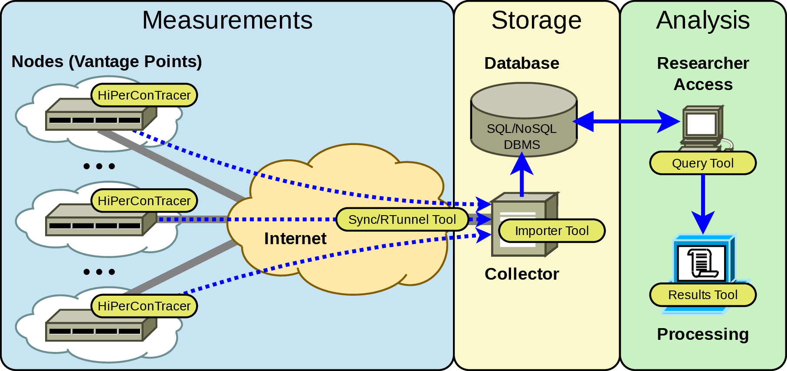

High-Performance Connectivity Tracer (HiPerConTracer) is a Ping/Traceroute measurement framework. It performs regular Ping and Traceroute runs among sites and can import the results into an SQL or NoSQL database. HiPerConTracer currently offers runs over ICMP and UDP.
The HiPerConTracer framework furthermore provides additional tools for helping to obtain, process, collect, store, and retrieve measurement data:

* [HiPerConTracer](#run-a-hipercontracer-measurement) for the actual measurement runs;
* [HiPerConTracer Viewer Tool](#the-hipercontracer-viewer-tool) for displaying the contents of results files;
* [HiPerConTracer Results Tool](#the-hipercontracer-results-tool) for merging and converting results files, e.g.&nbsp;to create a Comma-Separated Value&nbsp;(CSV) file;
* [HiPerConTracer Sync Tool](#the-hipercontracer-sync-tool) for copying data from a measurement node (vantage point) to a remote collector server (via [RSync](https://rsync.samba.org/)/[SSH](https://www.openssh.com/));
* [HiPerConTracer Reverse Tunnel Tool](#the-hipercontracer-reverse-tunnel-tool) for maintaining a reverse [SSH](https://www.openssh.com/) tunnel from a remote measurement node to a collector server;
* [HiPerConTracer Trigger Tool](#the-hipercontracer-trigger-tool) for triggering HiPerConTracer measurements in the reverse direction;
* [HiPerConTracer Importer Tool](#the-hipercontracer-importer-tool) for storing measurement data from results files into SQL or NoSQL databases. Currently, database backends for [MariaDB](https://mariadb.com/)/[MySQL](https://www.mysql.com/), [PostgreSQL](https://www.postgresql.org/) and [MongoDB](https://www.mongodb.com/) are provided;
* [HiPerConTracer Query Tool](#the-hipercontracer-query-tool) for querying data from a database and storing it into a results file;
* [HiPerConTracer Database Shell](#the-hipercontracer-database-shell) as simple command-line front-end for the underlying database backends;
* [HiPerConTracer Database Tools](#the-hipercontracer-database-tools) with some helper programs to e.g.&nbsp;to join HiPerConTracer database configurations into an existing [DBeaver](https://dbeaver.io/) (a popular SQL database GUI application) configuration;
* [HiPerConTracer UDP Echo Server](#the-hipercontracer-udp-echo-server) as UDP Echo ([RFC&nbsp;862](https://datatracker.ietf.org/doc/html/rfc862)) protocol endpoint.

<center>

</center>


# Build the HiPerConTracer Framework from Sources

Basic procedure:
```
cmake .
make
sudo make install
```

Notes:

- There are various CMake options to enable/disable database backends and tools. A GUI tool like CCMake provides a comfortable way of configuration.
- The CMake run will show missing dependencies, and provide help for installing them on Debian, Ubuntu and Fedora Linux as well as FreeBSD.


# Run a HiPerConTracer Measurement

HiPerConTracer is the measurement tool itself.

## Example 1
A simple Ping run, without data storage, from arbitrary local addresses, to all IPv4 and IPv6 addresses of [www.heise.de](https://www.heise.de) (resolved via DNS) via ICMP (default):
```
sudo hipercontracer --destination www.heise.de --ping --verbose
```

## Example 2
Run HiPerConTracer measurement #1000000, from arbitrary local IPv4 address to destination 193.99.144.80, using Traceroute and Ping. Store data into sub-directory "data" in the current directory; run as current user $USER:
```
sudo hipercontracer \
   --user $USER -#1000000 \
   --source 0.0.0.0 --destination 193.99.144.80 \
   --traceroute --ping \
   --resultsdirectory data \
   --verbose
```
Notes:

- Run HiPerConTracer as a non-privileged user ("\-\-user" option). HiPerConTracer only needs superuser permissions to create the raw sockets.
- HiPerConTracer uses the sub-directory "data" (provided by "\-\-resultsdirectory") to write the results files to. This directory must be writable for the user $USER!
- See the [manpage of "hipercontracer"](https://github.com/dreibh/hipercontracer/blob/master/src/hipercontracer.1) for various options to set Ping and Traceroute intervals, results file lengths, results file compression, etc.!

## Example 3
Run HiPerConTracer measurement #1000001, from arbitrary local IPv4 (0.0.0.0) and IPv6 (::) addresses to destinations 193.99.144.80 and 2a02:2e0:3fe:1001:302:: with Traceroute and Ping via ICMP (default). Store results files into sub-directory "data" in the current directory; run as current user $USER:
```
sudo hipercontracer \
   --user $USER \
   -#1000001 \
   --source 0.0.0.0 --source :: \
   --destination 193.99.144.80 --destination 2a02:2e0:3fe:1001:302:: \
   --traceroute --ping \
   --resultsdirectory data \
   --verbose
```

## Results File Examples

Some simple results file examples (from [src/results-examples](https://github.com/dreibh/hipercontracer/tree/master/src/results-examples)):

- [HiPerConTracer ICMP Ping over IPv4](https://github.com/dreibh/hipercontracer/blob/master/src/results-examples/Ping-ICMP-%231000001-0.0.0.0-20241219T090830.364329-000000001.hpct)
- [HiPerConTracer ICMP Ping over IPv6](https://github.com/dreibh/hipercontracer/blob/master/src/results-examples/Ping-ICMP-%231000001-%3A%3A-20241219T090830.364464-000000001.hpct)
- [HiPerConTracer ICMP Traceroute over IPv4](https://github.com/dreibh/hipercontracer/blob/master/src/results-examples/Traceroute-ICMP-%231000001-0.0.0.0-20241219T090830.364422-000000001.hpct)
- [HiPerConTracer ICMP Traceroute over IPv6](https://github.com/dreibh/hipercontracer/blob/master/src/results-examples/Traceroute-ICMP-%231000001-%3A%3A-20241219T090830.364515-000000001.hpct)

Notes:

- See the the [manpage of "hipercontracer"](https://github.com/dreibh/hipercontracer/blob/master/src/hipercontracer.1) for a detailed description of the results file formats: ```man hipercontracer```
- The HiPerConTracer Viewer Tool can be used to display results files, including uncompressed ones.
- The HiPerConTracer Results Tool can be used to merge and/or convert the results files.

## Further Details
See the the manpage of "hipercontracer" for all options, including a description of the results file formats!


# The HiPerConTracer Viewer Tool

The HiPerConTracer Viewer Tool displays the contents of a results file.

## Example
```
hpct-viewer src/results-examples/Traceroute-UDP-#88888888-fdb6:6d27:be73:4::50-20231018T102656.821891-000000001.results.xz
```

## Further Details
See the the [manpage of "hpct-viewer"](https://github.com/dreibh/hipercontracer/blob/master/src/hpct-viewer.1) for a detailed description of the available options: ```man hpct-viewer```


# The HiPerConTracer Results Tool

The HiPerConTracer Results Tool provides merging and converting data from results files, e.g.&nbsp;to create a Comma-Separated Value&nbsp;(CSV) file.

## Example 1
Merge the data from all files matching the pattern "Ping\*.hpct.\*" into CSV file "ping.csv.gz", with "," as separator:
```
find data -maxdepth 1 -name "Ping*.hpct.*" | \
   hpct-results --input-file-names-from-stdin --separator=, -o ping.csv.gz
```
Hint: You can use extension .gz for GZip, .bz for BZip2, .xz for XZ, or none for uncompressed output into the output CSV file!

## Example 2
Merge the data from all files matching the pattern "Traceroute\*.hpct.\*" into CSV file "traceroute.csv.xz", with ";" as separator:
```
find data -maxdepth 1 -name "Traceroute*.hpct.*" | \
   hpct-results --input-file-names-from-stdin --separator=; -o traceroute.csv.xz
```

## Processing Results from a CSV File

See [src/results-examples](https://github.com/dreibh/hipercontracer/blob/master/src/results-examples) for some examples.

### GNU R

See [src/results-examples/r-install-dependencies](https://github.com/dreibh/hipercontracer/blob/master/src/results-examples/r-install-dependencies) to get the necessary library packages installed!

- [r-ping-example](https://github.com/dreibh/hipercontracer/blob/master/src/results-examples/r-ping-example) ping.csv
- [r-traceroute-example](https://github.com/dreibh/hipercontracer/blob/master/src/results-examples/r-traceroute-example) traceroute.csv.gz

### LibreOffice (or any similar spreadsheet program)

Import CSV file into spreadsheet.

Hints:

- Use English (US) language, to avoid strange number conversions.
- Choose column separator (" ", ",", etc.), if not automatically detected.

## Further Details
See the the [manpage of "hpct-results"](https://github.com/dreibh/hipercontracer/blob/master/src/hpct-results.1) for a detailed description of the available options: ```man hpct-results```


# Setting Up a Database

See [src/SQL](https://github.com/dreibh/hipercontracer/tree/master/src/SQL) and [src/NoSQL](https://github.com/dreibh/hipercontracer/tree/master/src/NoSQL) for schema, user and permission setups. Use the database of your choice (MariaDB/MySQL, PostgreSQL, MongoDB).

Hint: All HiPerConTracer tools support TLS setup. It is **strongly** recommended to properly setup TLS for secure access to a database! See [src/TestDB](https://github.com/dreibh/hipercontracer/tree/master/src/TestDB) as example; this is the CI test, which includes a full TLS setup with all supported database backends.


# The HiPerConTracer Importer Tool

The HiPerConTracer Importer Tool provides the continuous storage of collected measurement data from results files into SQL or NoSQL databases. Currently, database backends for [MariaDB](https://mariadb.com/)/[MySQL](https://www.mysql.com/), [PostgreSQL](https://www.postgresql.org/) and [MongoDB](https://www.mongodb.com/) are provided.

## Write a Configuration File for the Importer

See [src/hipercontracer-database.conf](src/hipercontracer-database.conf) for an example. Make sure that the database access details are correct, so that the Query tool can connect to the right database and has the required permissions! See [src/SQL](https://github.com/dreibh/hipercontracer/tree/master/src/SQL) and [src/NoSQL](https://github.com/dreibh/hipercontracer/tree/master/src/NoSQL) for schema, user and permission setups.

Note: Make sure the "data" directory, as well as the directory for "good" imports and the directory for "bad" (i.e. failed) imports are existing and accessible by the user running the importer!

## Run the Importer Tool

### Example 1
Continuously run, waiting for new files to import:
```
hpct-importer ~/testdb-users-mariadb-importer.conf -verbose
```

### Example 2
Just run one import round, quit when there are no more files to import:
```
hpct-importer ~/testdb-users-mariadb-importer.conf -verbose --quit-when-idle
```

Note: If running without "--quit-when-idle" (recommended), the importer keeps running and imports new files as soon as they appear in the results directory. The importer uses INotify!

## Further Details
See the the [manpage of "hpct-importer"](https://github.com/dreibh/hipercontracer/blob/master/src/hpct-importer.1) for a detailed description of the available options: ```man hpct-importer```


# The HiPerConTracer Query Tool

## Write a Configuration File for the Query Tool

See [src/hipercontracer-database.conf](src/hipercontracer-database.conf) for an example. Make sure that the database access details are correct, so that the Query tool can connect to the right database and has the required permissions! See [src/SQL](https://github.com/dreibh/hipercontracer/tree/master/src/SQL) and [src/NoSQL](https://github.com/dreibh/hipercontracer/tree/master/src/NoSQL) for schema, user and permission setups.

## Run the Query Tool

### Example 1
Export all Ping data to ping.hpct.gz (GZip-compressed data file):
```
hpct-query ~/testdb-users-mariadb-researcher.conf ping -o ping.hpct.gz
```

Notes:

- Make sure to specify a Measurement ID range, or a time range. Otherwise, the Query tool will export **everything**!
- The output is in the same format as the originally written HiPerConTracer results. See the the manpage "hipercontracer" for all options, including a description of the results file formats!
- You can use extension .gz for GZip, .bz for BZip2, .xz for XZ, or none for uncompressed output!

### Example 2
Export all Ping data of Measurement ID #1000 to ping.hpct.gz (GZip-compressed data file):
```
hpct-query ~/testdb-users-mariadb-researcher.conf ping -o ping.hpct.gz --from-measurement-id 1000 --to-measurement-id 1000
```

### Example 3
Export all Traceroute data of Measurement ID #1000 to traceroute.hpct.bz2 (BZip2-compressed data file), with verbose logging:
```
hpct-query ~/testdb-users-mariadb-researcher.conf traceroute -o traceroute.hpct.bz2 --loglevel 0 --from-measurement-id 1000 --to-measurement-id 1000
```

### Example 4
Export all Traceroute data from 2023-09-22 00:00:00 to traceroute.hpct.xz (XZ-compressed data file), with verbose logging:
```
hpct-query ~/testdb-users-mariadb-researcher.conf traceroute -o traceroute.hpct.xz --verbose --from-time "2023-09-22 00:00:00"
```

### Example 5
Export all Traceroute data between 2023-09-22 00:00:00 and 2023-09-23 00:00:00 to traceroute.hpct.xz (XZ-compressed data file):
```
hpct-query ~/testdb-users-mariadb-researcher.conf traceroute -o traceroute.hpct.xz --verbose --from-time "2023-09-22 00:00:00" --to-time "2023-09-23 00:00:00"
```

## Further Details
See the the [manpage of "hpct-query"](https://github.com/dreibh/hipercontracer/blob/master/src/hpct-query.1) for a detailed description of the available options: ```man hpct-query```


# The HiPerConTracer Sync Tool

The HiPerConTracer Sync Tool helps synchronising collected results files to a collection server (denoted as Collector), using [RSync](https://rsync.samba.org/)/[SSH](https://www.openssh.com/)).

## Example
Synchronise results files, with the following settings:

- local node is Node 1000;
- run as user "hipercontracer";
- from local directory /var/hipercontracer;
- to remote server's directory /var/hipercontracer;
- remote server is sognsvann.example (must be a resolvable hostname);
- private key for logging into the remote server via SSH is in /var/hipercontracer/ssh/id_ed25519;
- known_hosts file for SSH is /var/hipercontracer/ssh/known_hosts;
- run with verbose output
```
sudo -u  hipercontracer  hpct-sync \
   --nodeid 1000 --collector sognsvann.example \
   --local /var/hipercontracer --remote /var/hipercontracer \
   --key /var/hipercontracer/ssh/id_ed25519 \
   --known-hosts /var/hipercontracer/ssh/known_hosts --verbose
```

## Further Details
See the the [manpage of "hpct-sync"](https://github.com/dreibh/hipercontracer/blob/master/src/hpct-sync.1) for a detailed description of the available options: ```man hpct-sync```


# The HiPerConTracer Reverse Tunnel Tool

The HiPerConTracer Reverse Tunnel (RTunnel) Tool maintains a reverse [SSH](https://www.openssh.com/) from a remote measurement node to a collector server. The purpose is to allow for SSH login from the collector server to the measurement node, via the reverse tunnel. Then, the measurement node does not need a publicly-reachable IP address (e.g.&nbsp;the node only has a private IP address behind a firewall).

## Example
Establish a Reverse Tunnel, with the following settings:

- local node is Node 1000;
- run as user "hipercontracer";
- connect to Collector server 10.44.35.16, using SSH private key from /var/hipercontracer/ssh/id_ed25519, with SSH known_hosts file /var/hipercontracer/ssh/known_hosts
```
sudo -u hipercontracer hpct-rtunnel \
   --nodeid 1000 --collector 10.44.35.16 \
   --key /var/hipercontracer/ssh/id_ed25519 \
   --known-hosts /var/hipercontracer/ssh/known_hosts
```

On the Collector, to connect to Node 1000:
```
hpct-ssh <user>@1000
```

## Further Details
See the the [manpage of "hpct-rtunnel"](https://github.com/dreibh/hipercontracer/blob/master/src/hpct-rtunnel.1) for a detailed description of the available options for hpct-rtunnel: ```man hpct-rtunnel```
Also see the [manpage of "hpct-ssh"](https://github.com/dreibh/hipercontracer/blob/master/src/hpct-ssh.1) for a detailed description of the available options for hpct-ssh: ```man hpct-ssh```


# The HiPerConTracer Trigger Tool

The HiPerConTracer Trigger Tool triggers HiPerConTracer measurements in the reverse direction, when a given number of Pings reaches the local node with a given size.

## Example:
Queue a received Ping's sender address after having received 2 Pings of 88 bytes for a Traceroute measurement from 10.1.1.51, run as user "hipercontracer" and use results directory "/var/hipercontracer":
```
sudo hpct-trigger \
   --user hipercontracer \
   --source 10.1.1.51 \
   --resultsdirectory=/var/hipercontracer \
   --traceroute \
   --triggerpingsbeforequeuing 2 --triggerpingpacketsize 88 \
   --verbose
```

## Further Details
See the the [manpage of "hpct-trigger"](https://github.com/dreibh/hipercontracer/blob/master/src/hpct-trigger.1) for a detailed description of the available options: ```man hpct-trigger```


# The HiPerConTracer Database Shell

The HiPerConTracer Database Shell (DBShell) is a simple tool to test a database configuration file by running a database client with the settings of the file. It will then provide an interactive shell.

## Example 1:
Connect to the database, using the configuration from "hipercontracer-importer.conf":
```
dbshell hipercontracer-importer.conf
```

## Example 2:
As Example 1, but also export the database configuration as [DBeaver](https://dbeaver.io/) configuration files (JSON for database, plain-text JSON for user credentials) with the prefix "dbeaver-config":
```
dbshell hipercontracer-database.conf --write-dbeaver-config dbeaver-config
```

## Further Details
See the the [manpage of "dbshell"](https://github.com/dreibh/hipercontracer/blob/master/src/dbshell.1) for a detailed description of the available options: ```man dbshell```


# The HiPerConTracer Database Tools

The HiPerConTracer Database Tools are some helper programs to e.g.&nbsp;join HiPerConTracer database configurations into an existing [DBeaver](https://dbeaver.io/) configuration:

- make-dbeaver-configuration: Make DBeaver configuration from HiPerConTracer database configuration files
- encrypt-dbeaver-configuration: Encrypt DBeaver credentials configuration file
- decrypt-dbeaver-configuration: Decrypt DBeaver credentials configuration file

See the manpages of the tools for further details!


# The HiPerConTracer UDP Echo Server
The HiPerConTracer UDP Echo Server provides an UDP Echo ([RFC&nbsp;862](https://datatracker.ietf.org/doc/html/rfc862)) service, particularly as endpoint of HiPerConTracer Ping and Traceroute measurements over UDP.

Important security notes:

- The UDP Echo Server only responds to source ports >= 1024, to avoid using the  server in attacks, like spoofing a packet from another Echo server (port 7) to create a flooding loop.
- Also, packets from the same port as the listening port are ignored!

## Example 1:
Start UDP Echo server on port 7777:
```
udp-echo-server --port 7777
```

A corresponding HiPerConTracer Ping measurement to this server could be run like:
```
sudo hipercontracer -D <SERVER_ADDRESS> -M UDP --ping --verbose --pingudpdestinationport 7777
```

## Example 2:
Start UDP Echo server on port 7 as user "hipercontracer":
```
sudo udp-echo-server --user hipercontracer --port 7
```

## Further Details
See the the [manpage of "udp-echo-server"](https://github.com/dreibh/hipercontracer/blob/master/src/udp-echo-server.1) for a detailed description of the available options: ```man udp-echo-server```
