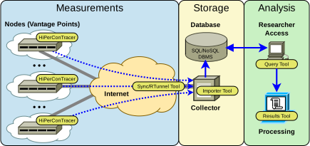

<h1 align="center">
 HiPerConTracer<br />
 <span style="font-size: 75%">High-Performance Connectivity Tracer</span><br />
 <a href="https://www.nntb.no/~dreibh/hipercontracer/">
  <br />
  <span style="font-size: 75%;">https://www.nntb.no/~dreibh/hipercontracer</span>
 </a>
</h1>


# 💡 What is High-Performance Connectivity Tracer&nbsp;(HiPerConTracer)?

High-Performance Connectivity Tracer&nbsp;(HiPerConTracer) is a Ping/Traceroute measurement framework.

[HiPerConTracer](#-running-a-hipercontracer-measurement) denotes the actual measurement tool. It performs regular Ping and Traceroute runs among sites, featuring:

- multi-transport-protocol support (ICMP, UDP);
- multi-homing and parallelism support;
- handling of load balancing in the network;
- multi-platform support (currently Linux and FreeBSD);
- [high-precision (nanoseconds) timing support (Linux timestamping, both software and hardware)](https://www.nntb.no/~dreibh/hipercontracer/#Publications-SoftCOM2023-Timestamping);
- a library (shared/static) to integrate measurement functionality into other software (libhipercontracer);
- open source and written in a performance- and portability-focused programming language (C++) with only limited dependencies.

Furthermore, the HiPerConTracer Framework provides additional tools for helping to obtain, process, collect, store, and retrieve measurement data:

* [HiPerConTracer Viewer Tool](#-the-hipercontracer-viewer-tool) for displaying the contents of results files;
* [HiPerConTracer Results Tool](#-the-hipercontracer-results-tool) for merging and converting results files, e.g.&nbsp;to create a Comma-Separated Value&nbsp;(CSV) file;
* [HiPerConTracer Sync Tool](#-the-hipercontracer-sync-tool) for copying data from a measurement node (vantage point) to a remote HiPerConTracer Collector server (via [RSync](https://rsync.samba.org/)/[SSH](https://www.openssh.com/));
* [HiPerConTracer Reverse Tunnel Tool](#-the-hipercontracer-reverse-tunnel-tool) for maintaining a reverse [SSH](https://www.openssh.com/) tunnel from a remote measurement node to a HiPerConTracer Collector server;
* [HiPerConTracer Collector/Node Tools](#-the-hipercontracer-collectornode-tools) for simplifying the setup of HiPerConTracer Nodes and a HiPerConTracer Collector server;
* [HiPerConTracer Trigger Tool](#-the-hipercontracer-trigger-tool) for triggering HiPerConTracer measurements in the reverse direction;
* [HiPerConTracer Importer Tool](#-the-hipercontracer-importer-tool) for storing measurement data from results files into SQL or NoSQL databases. Currently, database backends for [MariaDB](https://mariadb.com/)/[MySQL](https://www.mysql.com/), [PostgreSQL](https://www.postgresql.org/) and [MongoDB](https://www.mongodb.com/) are provided;
* [HiPerConTracer Query Tool](#-the-hipercontracer-query-tool) for querying data from a database and storing it into a results file;
* [HiPerConTracer Database Shell](#-the-hipercontracer-database-shell) as simple command-line front-end for the underlying database backends;
* [HiPerConTracer Database Tools](#-the-hipercontracer-database-tools) with some helper scripts to e.g.&nbsp;to join HiPerConTracer database configurations into an existing [DBeaver](https://dbeaver.io/) (a popular SQL database GUI application) configuration;
* [HiPerConTracer UDP Echo Server](#-the-hipercontracer-udp-echo-server) as UDP Echo ([RFC&nbsp;862](https://datatracker.ietf.org/doc/html/rfc862)) protocol endpoint;
* [Wireshark Dissector for HiPerConTracer Packets](#-wireshark-dissector-for-hipercontracer-packets)

<p align="center">
 
</p>


# 📦 Binary Package Installation

Please use the issue tracker at [https://github.com/dreibh/hipercontracer/issues](https://github.com/dreibh/hipercontracer/issues) to report bugs and issues!

## Ubuntu Linux

For ready-to-install Ubuntu Linux packages of HiPerConTracer, see [Launchpad PPA for Thomas Dreibholz](https://launchpad.net/~dreibh/+archive/ubuntu/ppa/+packages?field.name_filter=hipercontracer&field.status_filter=published&field.series_filter=)!

```bash
sudo apt-add-repository -sy ppa:dreibh/ppa
sudo apt-get update
sudo apt-get install hipercontracer-all
```

## Fedora Linux

For ready-to-install Fedora Linux packages of HiPerConTracer, see [COPR PPA for Thomas Dreibholz](https://copr.fedorainfracloud.org/coprs/dreibh/ppa/package/hipercontracer/)!

```bash
sudo dnf copr enable -y dreibh/ppa
sudo dnf install hipercontracer-all
```

## FreeBSD

For ready-to-install FreeBSD packages of HiPerConTracer, it is included in the ports collection, see [FreeBSD ports tree index of benchmarks/hipercontracer/](https://cgit.freebsd.org/ports/tree/benchmarks/hipercontracer/)!

```bash
sudo pkg install hipercontracer
```

Alternatively, to compile it from the ports sources:

```bash
cd /usr/ports/benchmarks/hipercontracer
make
sudo make install
```


# 💾 Build from Sources

HiPerConTracer is released under the [GNU General Public Licence&nbsp;(GPL)](https://www.gnu.org/licenses/gpl-3.0.en.html#license-text).

Please use the issue tracker at [https://github.com/dreibh/hipercontracer/issues](https://github.com/dreibh/hipercontracer/issues) to report bugs and issues!

## Development Version

The Git repository of the HiPerConTracer sources can be found at [https://github.com/dreibh/hipercontracer](https://github.com/dreibh/hipercontracer):

```bash
git clone https://github.com/dreibh/hipercontracer
cd hipercontracer
sudo ci/get-dependencies --install
cmake .
make
```

Optionally, for installation to the standard paths (usually under `/usr/local`):

```bash
sudo make install
```

Note: The script [`ci/get-dependencies`](https://github.com/dreibh/hipercontracer/blob/master/ci/get-dependencies) automatically  installs the build dependencies under Debian/Ubuntu Linux, Fedora Linux, and FreeBSD. For manual handling of the build dependencies, see the packaging configuration in [`debian/control`](https://github.com/dreibh/hipercontracer/blob/master/debian/control) (Debian/Ubuntu Linux), [`hipercontracer.spec`](https://github.com/dreibh/hipercontracer/blob/master/rpm/hipercontracer.spec) (Fedora Linux), and [`Makefile`](https://github.com/dreibh/hipercontracer/blob/master/freebsd/hipercontracer/Makefile) FreeBSD.

Contributions:

* Issue tracker: [https://github.com/dreibh/hipercontracer/issues](https://github.com/dreibh/hipercontracer/issues).
  Please submit bug reports, issues, questions, etc. in the issue tracker!

* Pull Requests for HiPerConTracer: [https://github.com/dreibh/hipercontracer/pulls](https://github.com/dreibh/hipercontracer/pulls).
  Your contributions to HiPerConTracer are always welcome!

* CI build tests of HiPerConTracer: [https://github.com/dreibh/hipercontracer/actions](https://github.com/dreibh/hipercontracer/actions).

* Coverity Scan analysis of HiPerConTracer: [https://scan.coverity.com/projects/dreibh-hipercontracer](https://scan.coverity.com/projects/dreibh-hipercontracer).

## Release Versions

See [https://www.nntb.no/~dreibh/hipercontracer/#current-stable-release](https://www.nntb.no/~dreibh/hipercontracer/#current-stable-release) for release packages!


# 🗃️ Recommended Directory Structure and File Permissions

In the simple case, HiPerConTracer can just be used as a measurement tool without creating special directory setups; to be described in [Running a HiPerConTracer Measurement](#-running-a-hipercontracer-measurement).

For a larger setup, particularly consisting of measurement nodes and/or database import, it is recommended to properly set up storage directories. As current best practises for using the HiPerConTracer framework securely, the following directory structure and file permissions are recommended:

## Users

* _hipercontracer_:
  Unprivileged user to run [HiPerConTracer](#-running-a-hipercontracer-measurement) or one of the framework tools.
* _node<1-9999>_:
  Unprivileged user on a [HiPerConTracer Collector](#-the-hipercontracer-collectornode-tools), to store the data collected by a remote [HiPerConTracer Node](#-the-hipercontracer-collectornode-tools).

## Groups

* _node<1-9999>_: A group for each node user.
* _hpct-nodes_: A group to provide read access to the data stored on a Collector. User hipercontracer should be a member of this group, but <b>not</b> the _node<1-9999>_ users!

## Directories and Permissions

* `/var/hipercontracer` (ownership: _hipercontracer_:_hipercontracer_; permissions: 755 = rwxr-xr-x)

   * `/var/hipercontracer/data` (ownership: _hipercontracer_:_hpct-nodes_; permissions: 755 = rwxr-xr-x)

     Storage for data recorded by [HiPerConTracer](#-running-a-hipercontracer-measurement).

   * `/var/hipercontracer/data/node<1-9999>`: (ownership: _node<1-9999>_:_hpct-nodes_; permissions: 755 = rwxr-xr-x)

     Storage for data transferred from a remote Node using the [HiPerConTracer Sync Tool](#-the-hipercontracer-sync-tool). Each of these node directories corresponds to a Node.

     Data is stored as _node<1-9999>_:_node<1-9999>_. The permissions only allow the user itself to modify files in its own directory. A _node<1-9999>_ user is <b>not</b> able to modify data of another _node<1-9999>_ user!

   * `/var/hipercontracer/good` (ownership: _hipercontracer_:_hpct-nodes_; permissions: 755 = rwxr-xr-x)

     Storage for data that was successfully imported into a database by using the [HiPerConTracer Importer Tool](#-the-hipercontracer-importer-tool). The Importer moves the data from `/var/hipercontracer/data` after import.

   * `/var/hipercontracer/bad` (ownership: _hipercontracer_:_hpct-nodes_; permissions: 755 = rwxr-xr-x)

     Storage for data that was not successfully imported into a database by using the [HiPerConTracer Importer Tool](#-the-hipercontracer-importer-tool). The Importer moves the data from `/var/hipercontracer/data` after import failure.

   * `/etc/hipercontracer/ssh` (ownership: _hipercontracer_:_hipercontracer_; permissions: 700 = rwx------)

     Storage for the SSH private/public key pair, as well as the known_hosts file, on a [HiPerConTracer Node](#-the-hipercontracer-collectornode-tools), to be used by [HiPerConTracer Sync Tool](#-the-hipercontracer-sync-tool) and [HiPerConTracer Reverse Tunnel Tool](#-the-hipercontracer-reverse-tunnel-tool).

  That is:

  ```bash
  sudo mkdir -p -m 755 /var/hipercontracer
  sudo chown hipercontracer:hipercontracer /var/hipercontracer
  for subDirectory in data good bad ; do
     sudo mkdir -p -m 755 /var/hipercontracer/$subDirectory
     sudo chown hipercontracer:hpct-nodes /var/hipercontracer/$subDirectory
  done
  sudo mkdir -p -m 700 /var/hipercontracer/ssh
  sudo chown hipercontracer:hipercontracer /var/hipercontracer/ssh
  ```

* `/etc/hipercontracer` (ownership: _root_:_root_; permissions: 755 = rwx------)

  Configuration files, e.g.&nbsp;for importer or database.

## Access Control Lists (ACL)

* `/var/hipercontracer/data`, `/var/hipercontracer/good`, and `/var/hipercontracer/bad`:

   These directories must be <b>writable</b> for the [HiPerConTracer Importer Tool](#-the-hipercontracer-importer-tool), to allow it to move files owned by _node<1-9999>_:_hpct-nodes_ without superuser permissions, as well as <b>readable</b> for members of the group hpct-nodes, for reading the node status files:

   * Linux (POSIX ACLs):

     ```bash
     sudo setfacl -Rm d:u:hipercontracer:rwx,u:hipercontracer:rwx,d:g:hpct-nodes:rx,g:hpct-nodes:rx \
        /var/hipercontracer/data /var/hipercontracer/good /var/hipercontracer/bad
     ```

   * FreeBSD (NFSv4 ACLs):

     ```bash
     sudo setfacl -Rm u:hipercontracer:modify_set:file_inherit/dir_inherit:allow,g:hpct-nodes:read_set:file_inherit/dir_inherit:allow \
        /var/hipercontracer/data /var/hipercontracer/good /var/hipercontracer/bad
     ```


# 😀 Running a HiPerConTracer Measurement

HiPerConTracer is the measurement tool itself.

## Example 1

A simple Ping run, without data storage, from arbitrary local addresses, to all IPv4 and IPv6 addresses of [www.heise.de](https://www.heise.de) (resolved by DNS) via ICMP (default):

```bash
sudo hipercontracer --destination www.heise.de --ping --verbose
```

## Example 2

Run HiPerConTracer measurement #1000000, from arbitrary local IPv4 address to destination 193.99.144.80 ([www.heise.de](https://www.heise.de)), using Traceroute and Ping. Store data into sub-directory `data` in the current directory; run as current user $USER:

```bash
sudo hipercontracer \
   --user $USER -#1000000 \
   --source 0.0.0.0 --destination 193.99.144.80 \
   --traceroute --ping \
   --resultsdirectory data \
   --verbose
```

Notes:

* Run HiPerConTracer as a non-privileged user (`--user` option). HiPerConTracer only needs superuser permissions to create the raw sockets.
* HiPerConTracer uses the sub-directory `data` (provided by `--resultsdirectory`) to write the results files to. This directory must be writable for the user $USER!
* See the [manpage of "hipercontracer"](https://github.com/dreibh/hipercontracer/blob/master/src/hipercontracer.1) for various options to set Ping and Traceroute intervals, results file lengths, results file compression, etc.:

  ```bash
  man hipercontracer
  ```

## Example 3

Run HiPerConTracer measurement #1000001, from arbitrary local IPv4 (0.0.0.0) and IPv6 (::) addresses to destinations 193.99.144.80 and 2a02:2e0:3fe:1001:302:: with Traceroute and Ping via ICMP (default). Store results files into sub-directory `data` in the current directory; run as current user $USER:

```bash
sudo hipercontracer \
   --user $USER \
   -#1000001 \
   --source 0.0.0.0 --source :: \
   --destination 193.99.144.80 --destination 2a02:2e0:3fe:1001:302:: \
   --traceroute --ping \
   --resultsdirectory data \
   --verbose
```

# 📄 Results File Formats

## Header

Header format:

```
#? HPCT format version programID
```

Header details:

| Column | Field     | Description                                                                   |
| :-:    | :--       | :---------                                                                    |
|  1     | format    | Measurement identifier (e.g. Ping, Traceroute)                                |
|  2     | version   | Version of the output data format (decimal)                                   |
|  3     | programID | Identifier for the program generating the output (e.g. HiPerConTracer/2.1.12) |

Header example:

```
#? HPCT Ping 2 HiPerConTracer/2.1.12
```


## Ping

### Version 2

#### Ping format, version 2

```
#P<io_module> measurementID sourceIP destinationIP timestamp burstseq traffic_class packetsize response_size checksum sourcePort destinationPort status timesource delay_app_send delay_queuing delay_app_receive rtt_app rtt_sw rtt_hw
```

#### Ping fields, version 2

| Column | Field             | Description                                                                                                         |
| :-:    | :--               | :----------------------                                                                                             |
|  1     | ping              | #P&lt;io_module&gt;, with #Pi = ICMP Ping, #Pu = UDP Ping                                                           |
|  2     | measurementID     | Measurement identifier (decimal)                                                                                    |
|  3     | sourceIP          | Source IP address                                                                                                   |
|  4     | destinationIP     | Destination IP address                                                                                              |
|  5     | sendTimestamp     | Send Timestamp (nanoseconds since the UTC epoch, hexadecimal)                                                       |
|  6     | burstseq          | Sequence number within a burst (decimal), numbered from 0                                                           |
|  7     | traffic_class     | The IP Traffic Class/Type of Service value of the sent packets (hexadecimal)                                        |
|  8     | packet_size       | The sent packet size (decimal, in bytes) including IPv4/IPv6 header, transport header and HiPerConTracer header     |
|  9     | response_size     | The response packet size (decimal, in bytes) including IPv4/IPv6 header, transport header and HiPerConTracer header |
| 10     | checksum          | The checksum of the ICMP Echo Request packets (hexadecimal); 0x0000 for other protocols, 0xffff for unknown         |
| 11     | sourcePort        | Source port, 0 for ICMP (decimal)                                                                                   |
| 12     | destinationPort   | Destination port, 0 for ICMP (decimal)                                                                              |
| 13     | status            | Status code (decimal); see [Status Code and Status Flags](#status-code-and-status-flags)                            |
| 14     | timesource        | Source of the timing information (hexadecimal) as AAQQSSHH; see [Time Source](#time-source)                         |
| 15     | delay_app_send    | The measured application send delay (nanoseconds, decimal; -1 if not available)                                     |
| 16     | delay_queuing     | The measured kernel software queuing delay (nanoseconds, decimal; -1 if not available)                              |
| 17     | delay_app_receive | The measured application receive delay (nanoseconds, decimal; -1 if not available)                                  |
| 18     | rtt_app           | The measured application RTT (nanoseconds, decimal)                                                                 |
| 19     | rtt_sw            | The measured kernel software RTT (nanoseconds, decimal; -1 if not available)                                        |
| 20     | rtt_hw            | The measured kernel hardware RTT (nanoseconds, decimal; -1 if not available)                                        |

: Ping Fields (Version 2)

#### Ping example, version 2

```
#Pi 88888888 10.193.4.168 10.193.4.67 178f2cc6c7ea013a 0 0 44 44 7d61 0 0 255 11666600 36997 6983 50311 426999 332708 -1
```

### Version 1

**Version 1 was used before HiPerConTracer&nbsp;2.0.0 and is now deprecated!** However, it can still be read and processed by the [HiPerConTracer Results Tool](#-the-hipercontracer-results-tool) and the [HiPerConTracer Importer Tool](#-the-hipercontracer-importer-tool). While [HiPerConTracer](#-running-a-hipercontracer-measurement) still can generate version&nbsp;1 output, this is strongly discouraged due to limitations of this format version!

#### Ping format, version 1

```
#P sourceIP destinationIP sendTimestamp checksum status rtt [traffic_class [packet_size [timesource]]]
```

#### Ping fields, version 1

| Column | Field           | Description                                                                                                     |
| :-:    | :--             | :----------------------                                                                                         |
|  1     | ping            | #P; HiPerConTracer &lt;2.0 only provided ICMP Ping                                                              |
|  2     | sourceIP        | Source IP address                                                                                               |
|  3     | destinationIP   | Destination IP address                                                                                          |
|  4     | sendTimestamp   | Send Timestamp (microseconds since the UTC epoch, hexadecimal)                                                  |
|  5     | checksum        | The checksum of the ICMP Echo Request packets (hexadecimal); 0x0000 for other protocols, 0xffff for unknown     |
|  6     | status          | Status code (decimal); see [Status Code and Status Flags](#status-code-and-status-flags)                        |
|  7     | rtt             | The measured RTT (microseconds, decimal)                                                                        |
|  8     | traffic_class   | The IP Traffic Class/Type of Service value of the sent packets (hexadecimal)                                    |
|  9     | packet_size     | The sent packet size (decimal, in bytes) including IPv4/IPv6 header, transport header and HiPerConTracer header |
| 10     | timesource      | Source of the timing information (hexadecimal) as AAQQSSHH; see [Time Source](#time-source)                     |

: Ping Fields (Version 1)

Notes:

* `traffic_class` was added in HiPerConTracer&nbsp;1.4.0.
* `packet_size` was added in HiPerConTracer&nbsp;1.6.0.
* `timesource` was added in HiPerConTracer&nbsp;2.0.0 development versions.

#### Ping example, version 1

```
#P 2001:700:4100:4::2 2001:250:3801:71::149 5ed91fe263db1 9106 200 5000000 0 6
```

## Traceroute

### Version 2

#### Traceroute format, version 2

```
#T<io_module> measurementID sourceIP destinationIP timestamp round totalHops traffic_class packet_size checksum sourcePort destinationPort statusFlags pathHash
⇥sendTimeStamp hopNumber response_size status timesource delay_queuing delay_app_receive rtt_app rtt_app rtt_sw rtt_hw hopIP
⇥...
```

#### Traceroute fields, version 2

| Column | Field             | Description                                                                                                          |
| :-:    | :--               | :--------------------                                                                                                |
|  1     | traceroute        | #T&lt;io_module&gt;, with #Ti = ICMP Traceroute, #Tu = UDP Traceroute                                                |
|  2     | measurementID     | Measurement identifier                                                                                               |
|  3     | sourceIP          | Source IP address                                                                                                    |
|  4     | destinationIP     | Destination IP address                                                                                               |
|  5     | timestamp         | Timestamp (nanoseconds since the UTC epoch, hexadecimal) of the current run. Note: This timestamp is only an identifier for the Traceroute run | All Traceroute rounds of the same run use the same timestamp here! The actual send timestamp of the request to each hop can be found in sendTimeStamp of the corresponding hop!               |
|  6     | round             | Round number (decimal)                                                                                               |
|  7     | totalHops         | Total hops (decimal)                                                                                                 |
|  8     | traffic_class     | The IP Traffic Class/Type of Service value of the sent packets (hexadecimal)                                         |
|  9     | packet_size       | The sent packet size (decimal, in bytes) including IPv4/IPv6 header, transport header and HiPerConTracer header      |
| 10     | checksum          | The checksum of the ICMP Echo Request packets (hexadecimal); 0x0000 for other protocols, 0xffff for unknown          |
| 11     | sourcePort        | Source port, 0 for ICMP (decimal)                                                                                    |
| 12     | destinationPort   | Destination port, 0 for ICMP (decimal)                                                                               |
| 13     | statusFlags       | Status flags including the status code for Ping above for the lower 8 bits (hexadecimal); see [Status Code and Status Flags](#status-code-and-status-flags) |
| 14     | pathHash          | Hash of the path (hexadecimal); see [Path Hash](#path-hash)                                                          |

: Traceroute Fields (Version 2)

For each hop:

| Column | Field             | Description                                                                                                          |
| :-:    | :--               | :--------------------                                                                                                |
|  1     | sendTimeStamp     | Timestamp (nanoseconds since the UTC epoch, hexadecimal) for the request to this hop                                 |
|  2     | hopNumber         | Number of the hop                                                                                                    |
|  3     | response_size     | The response packet size (decimal, in bytes) including IPv4/IPv6 header, transport header and HiPerConTracer header  |
|  4     | status            | Status code (decimal; the values are the same as for Ping, see see [Status Code and Status Flags](#status-code-and-status-flags)) |
|  5     | timesource        | Source of the timing information (hexadecimal) as AAQQSSHH; see [Time Source](#time-source)                          |
|  6     | delay_app_send    | The measured application send delay (nanoseconds, decimal; -1 if not available)                                      |
|  7     | delay_queuing     | The measured kernel software queuing delay (nanoseconds, decimal; -1 if not available)                               |
|  8     | delay_app_receive | The measured application receive delay (nanoseconds, decimal; -1 if not available)                                   |
|  9     | rtt_app           | The measured application RTT (nanoseconds, decimal)                                                                  |
| 10     | rtt_sw            | The measured kernel software RTT (nanoseconds, decimal; -1 if not available)                                         |
| 11     | rtt_hw            | The measured kernel hardware RTT (nanoseconds, decimal; -1 if not available)                                         |
| 12     | hopIP             | Hop IP address                                                                                                       |

: Traceroute Hop Fields (Version 2)

#### Traceroute example, version 2

```
#Ti 12345678 10.44.33.111 1.1.1.1 1795a9a23c629fbf 0 11 0 44 90e1 0 0 200 a7cfb997ef00d133
⇥1795a9a23c629fbf 1 56 1 116666aa 117720 19410 40428729 57465605 16899746 16778688 10.44.32.1
⇥1795a9a23c5919e1 2 56 1 116666aa 117473 18421 40878737 56759042 15744411 15665625 10.42.241.24
⇥1795a9a23c28493f 3 56 1 116666aa 119417 19180 59070590 59398475 189288 132438 10.42.241.1
⇥1795a9a23b66efe6 4 56 1 116666aa 569585 18709 67972981 69165724 604449 481875 158.36.144.49
⇥1795a9a24305dce5 5 56 1 116666aa 74164 13164 10927655 12438014 1423031 1370062 10.42.240.11
⇥1795a9a242fdee25 6 56 1 116666aa 74629 12132 11430786 12039303 521756 467438 158.36.84.53
⇥1795a9a242f3ae6c 7 56 1 116666aa 74315 11634 11205225 13171634 1880460 1787750 128.39.230.22
⇥1795a9a2426f70c5 8 96 1 116666aa 51574 9678 19737124 20904021 1105645 1060562 128.39.254.179
⇥1795a9a244849c7e 9 56 1 116666aa 93468 16452 15676158 16511633 725555 687625 128.39.254.79
⇥1795a9a2447bdf7e 10 56 1 116666aa 92733 15981 12837025 17723353 4777614 4718312 185.1.55.41
⇥1795a9a2447335b4 11 44 255 116666aa 85299 13915 16096643 17068626 872769 802375 1.1.1.1
```

### Version 1

**Version 1 was used before HiPerConTracer&nbsp;2.0.0 and is now deprecated!** However, it can still be read and processed by the [HiPerConTracer Results Tool](#-the-hipercontracer-results-tool) and the [HiPerConTracer Importer Tool](#-the-hipercontracer-importer-tool). While [HiPerConTracer](#-running-a-hipercontracer-measurement) still can generate version&nbsp;1 output, this is strongly discouraged due to limitations of this format version!

#### Traceroute format, version 1

```
#T sourceIP destinationIP timestamp round checksum totalHops statusFlags pathHash [traffic_class [packet_size]]
⇥hopNumber status rtt hopIP timesource [timesource]
⇥...
```

#### Traceroute fields, version 1

| Column | Field             | Description                                                                                                          |
| :-:    | :--               | :--------------------                                                                                                |
|  1     | traceroute        | #T; HiPerConTracer &lt;2.0 only provided ICMP Traceroute                                                             |
|  2     | sourceIP          | Source IP address                                                                                                    |
|  3     | destinationIP     | Destination IP address                                                                                               |
|  4     | timestamp         | Timestamp (microseconds since the UTC epoch, hexadecimal) of the current run. Note: This timestamp is only an identifier for the Traceroute run. All Traceroute rounds of the same run use the same timestamp here! |
|  5     | round             | Round number (decimal)                                                                                               |
|  6     | checksum          | The checksum of the ICMP Echo Request packets (hexadecimal); 0x0000 for other protocols, 0xffff for unknown          |
|  7     | totalHops         | Total hops (decimal)                                                                                                 |
|  8     | statusFlags       | Status flags including the status code for Ping above for the lower 8 bits (hexadecimal)                             |
|  9     | pathHash          | Hash of the path (hexadecimal); see [Path Hash](#path-hash)                                                          |
| 10     | traffic_class     | The IP Traffic Class/Type of Service value of the sent packets (hexadecimal)                                         |
| 11     | packet_size       | The sent packet size (decimal, in bytes) including IPv4/IPv6 header, transport header and HiPerConTracer header      |

: Traceroute Fields (Version 1)

For each hop:

| Column | Field             | Description                                                                                                          |
| :-:    | :--               | :--------------------                                                                                                |
|  1     | hopNumber         | Number of the hop                                                                                                    |
|  2     | status            | Status code (in **hexadecimal** here)                                                                                |
|  3     | rtt               | The measured RTT (microseconds, decimal)                                                                             |
|  4     | hopIP             | Hop IP address                                                                                                       |
|  5     | timesource        | Source of the timing information (hexadecimal) as AAQQSSHH; see [Time Source](#time-source)                          |

: Traceroute Hop Fields (Version 1)

Notes:

* `traffic_class` was added in HiPerConTracer&nbsp;1.4.0.
* `packet_size` was added in HiPerConTracer&nbsp;1.6.0.
* `timesource` was added in HiPerConTracer&nbsp;2.0.0 development versions.

#### Traceroute example, version 1

```
#T 192.168.0.88 8.8.8.8 5d2f2db8ecbb3 0 2be 12 200 ea86903f1fdb8faa 0 44
⇥1 1 9858 192.168.0.1
⇥2 1 18552 10.248.0.1
⇥3 1 18573 84.208.41.118
⇥4 1 18595 109.163.76.161
⇥5 1 18618 109.163.76.160
⇥6 1 18641 62.115.175.156
⇥7 1 24116 62.115.116.101
⇥8 1 24135 62.115.142.219
⇥9 1 24157 72.14.205.198
⇥10 1 24179 142.251.67.181
⇥11 1 18755 142.250.239.185
⇥12 ff 18863 8.8.8.8
```

## Special Fields

### Status Code and Status Flags

The status code provides the result of a Ping, i.e.&nbsp;whether the remote endpoint responded or there was a local or on-route error, as unsigned byte:

| Status Code | Description                                                                                                                                        | Meaning of the Corresponding RTT Value      |
| :-:         | :---------                                                                                                                                         | :---------                                  |
|    1        | [ICMP](https://www.rfc-editor.org/rfc/rfc792)/[ICMPv6](https://datatracker.ietf.org/doc/html/rfc4443) response: Time Exceeded                      | Response from router sending the ICMP error |
|  100        | [ICMP](https://www.rfc-editor.org/rfc/rfc792)/[ICMPv6](https://datatracker.ietf.org/doc/html/rfc4443) response: Unreachable scope                  | Response from router sending the ICMP error |
|  101        | [ICMP](https://www.rfc-editor.org/rfc/rfc792)/[ICMPv6](https://datatracker.ietf.org/doc/html/rfc4443) response: Unreachable network                | Response from router sending the ICMP error |
|  102        | [ICMP](https://www.rfc-editor.org/rfc/rfc792)/[ICMPv6](https://datatracker.ietf.org/doc/html/rfc4443) response: Unreachable host                   | Response from router sending the ICMP error |
|  103        | [ICMP](https://www.rfc-editor.org/rfc/rfc792)/[ICMPv6](https://datatracker.ietf.org/doc/html/rfc4443) response: Unreachable protocol               | Response from router sending the ICMP error |
|  104        | [ICMP](https://www.rfc-editor.org/rfc/rfc792)/[ICMPv6](https://datatracker.ietf.org/doc/html/rfc4443) response: Unreachable port                   | Response from router sending the ICMP error |
|  105        | [ICMP](https://www.rfc-editor.org/rfc/rfc792)/[ICMPv6](https://datatracker.ietf.org/doc/html/rfc4443) response: Unreachable, prohibited (firewall) | Response from router sending the ICMP error |
|  110        | [ICMP](https://www.rfc-editor.org/rfc/rfc792)/[ICMPv6](https://datatracker.ietf.org/doc/html/rfc4443) response: Unreachable, unknown reason        | Response from router sending the ICMP error |
|  200        | Timeout (no response from a router)                                                                                                                | Timeout value configured for HiPerConTracer |
|  210        | sendto() call failed (generic error)                                                                                                               | RTT is set to 0                             |
|  211        | sendto() error: tried to send to broadcast address ([EACCES](https://en.wikipedia.org/wiki/Errno.h#POSIX_errors))                                  | RTT is set to 0                             |
|  212        | sendto() error: network unreachable ([ENETUNREACH](https://en.wikipedia.org/wiki/Errno.h#POSIX_errors))                                            | RTT is set to 0                             |
|  213        | sendto() error: host unreachable ([HOSTUNREACH](https://en.wikipedia.org/wiki/Errno.h#POSIX_errors))                                               | RTT is set to 0                             |
|  214        | sendto() error: address not available ([ADDRNOTAVAIL](https://en.wikipedia.org/wiki/Errno.h#POSIX_errors))                                         | RTT is set to 0                             |
|  215        | sendto() error: invalid message size ([MSGSIZE](https://en.wikipedia.org/wiki/Errno.h#POSIX_errors))                                               | RTT is set to 0                             |
|  216        | sendto() error: not enough buffer space ([NOBUFS](https://en.wikipedia.org/wiki/Errno.h#POSIX_errors))                                             | RTT is set to 0                             |
|  255        | Success (destination has responded)                                                                                                                | The actual RTT to the destination           |

: Status Codes

The status flag extends the status code, by providing an overall result of a Traceroute run consisting of multiple Ping measurements. That is: StatusCode := (StatusFlags & 0xff).

| Status Flag | Description                                                                             |
| :-:         | :---------                                                                              |
|  0x100      | Route with "\*" (at least one router did not respond; see also [Path Hash](#path-hash)) |
|  0x200      | Destination has responded                                                               |

: Status Flags

### Time Source

The time source provides the source of the recorded timing information as hexadecimal 4-byte unsigned integer AAQQSSHH:

| Component | Description                                                             |
| :-:       | :--------------------                                                   |
| AA        | Application                                                             |
| QQ        | Queuing (queuing packet until sending it by driver, in software)        |
| SS        | Software (sending request by driver until receiving response by driver) |
| HW        | Hardware (sending request by NIC until receiving response by NIC)       |

: Time Source Components

Each byte AA, QQ, SS, HH provides the receive time source (upper nibble) and send time source (lower nibble):

| Nibble | Description                                                                               |
| :-:    | :--------------------                                                                     |
| 0x0    | Not available                                                                             |
| 0x1    | System clock                                                                              |
| 0x2    | SO_TIMESTAMPING socket option, microseconds granularity                                   |
| 0x3    | SO_TIMESTAMPINGNS socket option (or SO_TIMESTAMPING+SO_TS_CLOCK), nanoseconds granularity |
| 0x4    | SIOCGSTAMP ioctl, microseconds granularity                                                |
| 0x5    | SIOCGSTAMPNS ioctl, nanoseconds granularity                                               |
| 0x6    | SO_TIMESTAMPING socket option, in software, nanoseconds granularity                       |
| 0xa    | SO_TIMESTAMPING socket option, in hardware, nanoseconds granularity                       |

: Time Source Values

For details, particularly also see: [Dreibholz, Thomas](https://www.nntb.no/~dreibh/): «[High-Precision Round-Trip Time Measurements in the Internet with HiPerConTracer](https://web-backend.simula.no/sites/default/files/2023-10/SoftCOM2023-Timestamping.pdf)» ([PDF](https://web-backend.simula.no/sites/default/files/2023-10/SoftCOM2023-Timestamping.pdf), 12474&nbsp;KiB, 7&nbsp;pages, 🇬🇧), in *Proceedings of the 31st International Conference on Software, Telecommunications and Computer Networks&nbsp;(SoftCOM)*, DOI&nbsp;[10.23919/SoftCOM58365.2023.10271612](https://dx.doi.org/10.23919/SoftCOM58365.2023.10271612), ISBN&nbsp;979-8-3503-0107-6, Split, Dalmacija/Croatia, September&nbsp;22, 2023.

### Path Hash

The path hash is an [SHA-1](https://www.rfc-editor.org/rfc/rfc3174.html) hash over the textual representation of a Traceroute run, i.e.&nbsp;SHA1("&lt;Source IP&gt;-&lt;Router 1 IP&gt;-&lt;...&gt;-&lt;Router *n* IP&gt;-&lt;Destination IP&gt;"), where the IP addresses correspond to source, destination, and routers. If a router is unknown, it is represented by "\*". The purpose of the path hash is to quickly identify identical paths. In this case, of course, routers must have consistently responded (non-"\*", i.e.&nbsp;revealing their IP address) or not responded ("\*") to lead to the same hash value.


## Results File Examples

Some simple results file examples (from [`src/results-examples`](https://github.com/dreibh/hipercontracer/tree/master/src/results-examples)):

* [HiPerConTracer ICMP Ping over IPv4](https://github.com/dreibh/hipercontracer/blob/master/src/results-examples/Ping-ICMP-%231000001-0.0.0.0-20241219T090830.364329-000000001.hpct)
* [HiPerConTracer ICMP Ping over IPv6](https://github.com/dreibh/hipercontracer/blob/master/src/results-examples/Ping-ICMP-%231000001-%3A%3A-20241219T090830.364464-000000001.hpct)
* [HiPerConTracer ICMP Traceroute over IPv4](https://github.com/dreibh/hipercontracer/blob/master/src/results-examples/Traceroute-ICMP-%231000001-0.0.0.0-20241219T090830.364422-000000001.hpct)
* [HiPerConTracer ICMP Traceroute over IPv6](https://github.com/dreibh/hipercontracer/blob/master/src/results-examples/Traceroute-ICMP-%231000001-%3A%3A-20241219T090830.364515-000000001.hpct)

Notes:

* See the [manpage of "hipercontracer"](https://github.com/dreibh/hipercontracer/blob/master/src/hipercontracer.1) for a description of the results file formats:

  ```bash
  man hipercontracer
  ```

* [HiPerConTracer Viewer Tool](#-the-hipercontracer-viewer-tool) can be used to display results files, including uncompressed ones.
* [HiPerConTracer Results Tool](#-the-hipercontracer-results-tool) can be used to merge and/or convert the results files.

## Further Details

See the [manpage of "hipercontracer"](https://github.com/dreibh/hipercontracer/blob/master/src/hipercontracer.1) for all options, including a description of the results file formats:

```bash
man hipercontracer
```


# 📚 The HiPerConTracer Viewer Tool

The HiPerConTracer Viewer Tool displays the contents of a results file.

## Example

```bash
hpct-viewer src/results-examples/Traceroute-UDP-#88888888-fdb6:6d27:be73:4::50-20231018T102656.821891-000000001.results.xz
```

## Further Details

See the [manpage of "hpct-viewer"](https://github.com/dreibh/hipercontracer/blob/master/src/hpct-viewer.1) for a detailed description of the available options:

```bash
man hpct-viewer
```


# 📚 The HiPerConTracer Results Tool

The HiPerConTracer Results Tool provides merging and converting data from results files, e.g.&nbsp;to create a Comma-Separated Value&nbsp;(CSV) file.

## Example 1
Merge the data from all files matching the pattern `Ping*.hpct.*` into CSV file `ping.csv.gz`, with "," as separator:

```bash
find data -maxdepth 1 -name "Ping*.hpct.*" | \
   hpct-results --input-file-names-from-stdin --separator=, -o ping.csv.gz
```

Hint: You can use the extension .gz for GZip, .bz for BZip2, .xz for XZ, .zst for ZSTD, or none for uncompressed output into the output CSV file!

## Example 2
Merge the data from all files matching the pattern `Traceroute*.hpct.*` into CSV file `traceroute.csv.xz`, with ";" as separator:

```bash
find data -maxdepth 1 -name "Traceroute*.hpct.*" | \
   hpct-results --input-file-names-from-stdin --separator=; -o traceroute.csv.xz
```

## Further Details

See the [manpage of "hpct-results"](https://github.com/dreibh/hipercontracer/blob/master/src/hpct-results.1) for a detailed description of the available options:

```bash
man hpct-results
```


# 📚 Processing Results for Analysis

The directory [`src/results-examples`](https://github.com/dreibh/hipercontracer/tree/master/src/results-examples) contains some example results files, as well as some example scripts for reading them and computing some statistics.

## GNU&nbsp;R

The [GNU&nbsp;R](https://www.r-project.org/) examples need, in addition to GNU&nbsp;R, some libraries. See [`src/results-examples/r-install-dependencies`](https://github.com/dreibh/hipercontracer/blob/master/src/results-examples/r-install-dependencies) to get the necessary library packages installed from the [Comprehensive R Archive Network&nbsp;(CRAN)](https://cran.stat.auckland.ac.nz/)!

Alternatively:

* Ubuntu/Debian:
  ```bash
  sudo apt install -y r-base-core r-cran-data.table r-cran-digest r-cran-dplyr r-cran-nanotime r-cran-xtable
  ```
* Fedora:
  ```bash
  sudo dnf install -y R-core R-data.table R-digest R-dplyr R-nanotime R-xtable
  ```
* FreeBSD:
  ```bash
  sudo pkg install -y R R-cran-data.table R-cran-digest R-cran-dplyr R-cran-xtable
  ```
  Note: `R-cran-nanotime` is missing in FreeBSD; it still needs to be installed from CRAN!

## Example for Ping Results Processing in R

See [`r-ping-example`](https://github.com/dreibh/hipercontracer/blob/master/src/results-examples/r-ping-example) for the script, and [`src/results-examples`](https://github.com/dreibh/hipercontracer/tree/master/src/results-examples) for some example results files! The Ping example creates a statistical summary table for each Measurement&nbsp;ID / Source&nbsp;IP / Destination&nbsp;IP / Protocol relation found in the given input results file(s).

Usage:

* With HiPerConTracer Ping results file:

  ```bash
  ./r-ping-example \
     Ping-P13735-2001:700:4100:4::2-20221012T142120.713761-000003330.results.bz2 \
     output
  ```

  Note: The script calls the [HiPerConTracer Results Tool](#-the-hipercontracer-results-tool) for processing of the input file. It therefore must to be installed.

  Outputs:
  * `output.csv`: A summary table as CSV file.
  * `output.tex`: A summary table as HTML file.
  * `output.tex`: A summary table as LaTeX file, for inclusion into a LaTeX publication.

* With all HiPerConTracer Ping results files in a directory:

  ```bash
  ./r-ping-example . output
  ```

  Note:
  * The provided directory ("`.`", i.e.&nbsp;the current directory) is searched for all HiPerConTracer Ping results files.
  * The script calls the [HiPerConTracer Results Tool](#-the-hipercontracer-results-tool) for processing of the input files. It therefore must to be installed.

* With a CSV file:

  ```bash
  ./r-ping-example ping.csv output
  ```

  Note: `ping.csv` has to be created in advance from HiPerConTracer Ping results, e.g.&nbsp;using the [HiPerConTracer Results Tool](#-the-hipercontracer-results-tool).

## Example for Traceroute Results Processing in R

See [`r-traceroute-example`](https://github.com/dreibh/hipercontracer/blob/master/src/results-examples/r-traceroute-example) for the script, and [`src/results-examples`](https://github.com/dreibh/hipercontracer/tree/master/src/results-examples) for some example results files! The Traceroute example simply counts the number of HiPerConTracer Traceroute runs for each Measurement&nbsp;ID / Source&nbsp;IP / Destination&nbsp;IP / Protocol relation found in the given input results file(s).

Usage:

* With HiPerConTracer Traceroute results file:

  ```bash
  ./r-traceroute-example \
     Traceroute-UDP-#88888888-10.193.4.168-20231018T102656.814657-000000001.results.xz
  ```

  Note: The script calls the [HiPerConTracer Results Tool](#-the-hipercontracer-results-tool) for processing of the input file. It therefore must to be installed.

* With all HiPerConTracer Traceroute results files in a directory:

  ```bash
  ./r-traceroute-example .
  ```

  Note: The script calls the [HiPerConTracer Results Tool](#-the-hipercontracer-results-tool) for processing of the input file. It therefore must to be installed.

* With a CSV file:

  ```bash
  ./r-traceroute-example traceroute.csv
  ```

  Note: `traceroute.csv` has to be created in advance from HiPerConTracer Traceroute results, e.g.&nbsp;using the [HiPerConTracer Results Tool](#-the-hipercontracer-results-tool).

## LibreOffice (or any similar spreadsheet program)

Import CSV file into spreadsheet.

Hints:

* Use _English (US)_ language, to avoid strange number conversions.
* Specify the used column separator (" ", ",", etc.), if not detected automatically.


# 🗃️ Setting Up a Database for Results Collection

See [`src/SQL`](https://github.com/dreibh/hipercontracer/tree/master/src/SQL) and [`src/NoSQL`](https://github.com/dreibh/hipercontracer/tree/master/src/NoSQL) for schema, user and permission setups. Create the database of your choice ([MariaDB](https://mariadb.com/)/[MySQL](https://www.mysql.com/), [PostgreSQL](https://www.postgresql.org/), or [MongoDB](https://www.mongodb.com/)).

Use separate users for importer (import access only), researcher (read-only access to the data) and maintainer (full access), for improved security.

Hint: The HiPerConTracer tools support Transport Layer Security&nbsp;(TLS) configuration. It is **strongly** recommended to properly setup TLS for secure access to a database!

See [`src/TestDB`](https://github.com/dreibh/hipercontracer/tree/master/src/TestDB) as example. This is the CI test, which includes a full database setup and test cycle with all supported database backends. Of course, this setup also includes proper TLS setup as well.


# 📚 The HiPerConTracer Importer Tool

The HiPerConTracer Importer Tool provides the continuous storage of collected measurement data from results files into SQL or NoSQL databases. Currently, database backends for [MariaDB](https://mariadb.com/)/[MySQL](https://www.mysql.com/), [PostgreSQL](https://www.postgresql.org/) and [MongoDB](https://www.mongodb.com/) are provided.

## Write Configuration Files for the Importer

See [`src/hipercontracer-importer.conf`](src/hipercontracer-importer.conf) (importer configuration) and [`src/hipercontracer-database.conf`](src/hipercontracer-database.conf) (database configuration) for examples. Make sure that the database access details are correct, so that Importer Tool and Query Tool can connect to the right database and has the required permissions! See [`src/SQL`](https://github.com/dreibh/hipercontracer/tree/master/src/SQL) and [`src/NoSQL`](https://github.com/dreibh/hipercontracer/tree/master/src/NoSQL) for schema, user and permission setups. Use the [HiPerConTracer Database Shell](#-the-hipercontracer-database-shell) tool to verify and debug access.

Note: Make sure the `data` directory, as well as the directory for `good` imports and the directory for `bad` (i.e.&nbsp;failed) imports are existing and accessible by the user running the importer!

## Run the Importer Tool

### Example 1

Just run one import round, quit when there are no more files to import:

```bash
hpct-importer \
   --importer-config hipercontracer-importer.conf \
   --database-config hipercontracer-database.conf \
   --verbose \
   --quit-when-idle
```

### Example 2

Continuously run, waiting for new files to import:

```bash
hpct-importer \
   --importer-config hipercontracer-importer.conf \
   --database-config hipercontracer-database.conf \
   --verbose
```

Note: If running without `--quit-when-idle` (recommended), the importer keeps running and imports new files as soon as they appear in the results directory. The importer uses [INotify](https://en.wikipedia.org/wiki/Inotify)!

## Further Details

See the [manpage of "hpct-importer"](https://github.com/dreibh/hipercontracer/blob/master/src/hpct-importer.1) for a detailed description of the available options:

```bash
man hpct-importer
```


# 📚 The HiPerConTracer Query Tool

## Write a Configuration File for the Query Tool

See [`src/hipercontracer-database.conf`](src/hipercontracer-database.conf) for an example. Make sure that the database access details are correct, so that the Query tool can connect to the right database and has the required permissions! See [`src/SQL`](https://github.com/dreibh/hipercontracer/tree/master/src/SQL) and [`src/NoSQL`](https://github.com/dreibh/hipercontracer/tree/master/src/NoSQL) for schema, user and permission setups. Use the [HiPerConTracer Database Shell](#-the-hipercontracer-database-shell) tool to verify and debug access.

## Run the Query Tool

### Example 1

Export all Ping data to `ping.hpct.gz` (GZip-compressed data file):

```bash
hpct-query ~/testdb-users-mariadb-researcher.conf ping -o ping.hpct.gz
```

Notes:

* Make sure to specify a Measurement ID range, or a time range. Otherwise, the Query tool will export **everything**!
* The output is in the same format as the originally written HiPerConTracer results. See the [manpage of "hipercontracer"](https://github.com/dreibh/hipercontracer/blob/master/src/hipercontracer.1) for all options, including a description of the results file formats: ```bashman hipercontracer```
* You can use the extension .gz for GZip, .bz for BZip2, .xz for XZ, .zst for ZSTD, or none for uncompressed output!

### Example 2

Export all Ping data of Measurement ID #1000 to `ping.hpct.gz` (GZip-compressed data file):

```bash
hpct-query ~/testdb-users-mariadb-researcher.conf \
   ping -o ping.hpct.gz \
   --from-measurement-id 1000 --to-measurement-id 1000
```

### Example 3

Export all Traceroute data of Measurement ID #1000 to `traceroute.hpct.bz2` (BZip2-compressed data file), with verbose logging:

```bash
hpct-query ~/testdb-users-mariadb-researcher.conf \
   traceroute -o traceroute.hpct.bz2 --loglevel 0 \
   --from-measurement-id 1000 --to-measurement-id 1000
```

### Example 4

Export all Traceroute data from 2023-09-22 00:00:00 to `traceroute.hpct.xz` (XZ-compressed data file), with verbose logging:

```bash
hpct-query ~/testdb-users-mariadb-researcher.conf \
   traceroute -o traceroute.hpct.xz --verbose \
   --from-time "2023-09-22 00:00:00"
```

### Example 5

Export all Traceroute data from time interval [2023-09-22 00:00:00, 2023-09-23 00:00:00) to `traceroute.hpct.xz` (XZ-compressed data file):

```bash
hpct-query ~/testdb-users-mariadb-researcher.conf \
   traceroute -o traceroute.hpct.xz --verbose \
   --from-time "2023-09-22 00:00:00" --to-time "2023-09-23 00:00:00"
```

Note: data for time stamp 2023-09-23 00:00:00 will **not** be included, only data for time stamps **less than** 2023-09-23 00:00:00, i.e.&nbsp;data within the time interval [to-time, from-time). This ensures the possibility to e.g.&nbsp;export daily batches without having the same value included in two files!

## Further Details

See the [manpage of "hpct-query"](https://github.com/dreibh/hipercontracer/blob/master/src/hpct-query.1) for a detailed description of the available options:

```bash
man hpct-query
```


# 📚 The HiPerConTracer Sync Tool

The HiPerConTracer Sync Tool helps synchronising collected results files from a vantage point (denoted as HiPerConTracer Node) to a collection server (denoted as HiPerConTracer Collector), using [RSync](https://rsync.samba.org/)/[SSH](https://www.openssh.com/).

For information about the necessary underlying directory structure and file permissions, see
[Recommended Directory Structure and File Permissions](#-recommended-directory-structure-and-file-permissions). In case of problems, a misconfiguration of these is the most likely issue!

## Example
Synchronise results files, with the following settings:

* local node is Node 1000;
* run as user _hipercontracer_;
* from local directory `/var/hipercontracer`;
* to remote server's directory `/var/hipercontracer` (here, the data is going to be stored in sub-directory "1000");
* remote server is sognsvann.domain.example (must be a resolvable hostname);
* private key for logging into the remote server via SSH is in `/var/hipercontracer/ssh/id_ed25519`;
* known_hosts file for SSH is `/var/hipercontracer/ssh/known_hosts`;
* run with verbose output.

```bash
sudo -u hipercontracer hpct-sync \
   --nodeid 1000 \
   --collector sognsvann.domain.example \
   --local /var/hipercontracer --remote /var/hipercontracer \
   --key /var/hipercontracer/ssh/id_ed25519 \
   --known-hosts /var/hipercontracer/ssh/known_hosts --verbose
```

## Further Details

See the [manpage of "hpct-sync"](https://github.com/dreibh/hipercontracer/blob/master/src/hpct-sync.1) for a detailed description of the available options:

```bash
man hpct-sync
```


# 📚 The HiPerConTracer Reverse Tunnel Tool

The HiPerConTracer Reverse Tunnel (RTunnel) Tool maintains a reverse [SSH](https://www.openssh.com/) tunnel from a remote HiPerConTracer Node to a HiPerConTracer Collector server. The purpose is to allow for SSH login from the Collector server to the Node, via this reverse tunnel. Then, the Node does not need a publicly-reachable IP address (e.g.&nbsp;a Node only having a private IP address behind a NAT/PAT firewall).

For information about the necessary underlying directory structure and file permissions, see
[Recommended Directory Structure and File Permissions](#-recommended-directory-structure-and-file-permissions). In case of problems, a misconfiguration of these is the most likely issue!

## Example
Establish a Reverse Tunnel, with the following settings:

* local node is Node 1000;
* run as user _hipercontracer_;
* connect to Collector server 10.44.35.16;
* using SSH private key from `/var/hipercontracer/ssh/id_ed25519`;
* with SSH known_hosts file `/var/hipercontracer/ssh/known_hosts`.

```bash
sudo -u hipercontracer hpct-rtunnel \
   --nodeid 1000 --collector 10.44.35.16 \
   --key /var/hipercontracer/ssh/id_ed25519 \
   --known-hosts /var/hipercontracer/ssh/known_hosts
```

On the Collector, to connect to Node 1000:

```bash
hpct-ssh <USER>@1000
```

## Further Details

See the [manpage of "hpct-rtunnel"](https://github.com/dreibh/hipercontracer/blob/master/src/hpct-rtunnel.1) for a detailed description of the available options for hpct-rtunnel:

```bash
man hpct-rtunnel
```

Also see the [manpage of "hpct-ssh"](https://github.com/dreibh/hipercontracer/blob/master/src/hpct-ssh.1) for a detailed description of the available options for hpct-ssh:

```bash
man hpct-ssh
```


# 📚 The HiPerConTracer Collector/Node Tools

The HiPerConTracer Collector/Node Tools are some scripts for simplifying the setup of Nodes and a Collector server. Mainly, they ensure the creation of Node configurations on the Collector, and corresponding setup of HiPerConTracer Sync Tool and HiPerConTracer Reverse Tunnel.

* [hpct-node-setup](https://github.com/dreibh/hipercontracer/blob/master/src/hpct-node-setup) (on a Node): Connect the node to a Collector.
* [hpct-nodes-list](https://github.com/dreibh/hipercontracer/blob/master/src/hpct-nodes-list) (on the Collector): List connected nodes, together with status information about last data synchronisation and reverse tunnel setup.
* [hpct-node-removal](https://github.com/dreibh/hipercontracer/blob/master/src/hpct-node-removal) (on the Collector): Remove a node from the Collector.

See the manpages of these tools for further details!

For information about the necessary underlying directory structure and file permissions, see
[Recommended Directory Structure and File Permissions](#-recommended-directory-structure-and-file-permissions). In case of problems, a misconfiguration of these is the most likely issue!


# 📚 The HiPerConTracer Trigger Tool

The HiPerConTracer Trigger Tool triggers HiPerConTracer measurements in the reverse direction, when a given number of Pings having a given size reaching the local node.

## Example

Queue a received Ping's sender address after having received 2 Pings of 88 bytes for a Traceroute measurement from 10.1.1.51, run as user _hipercontracer_ and use results directory "/var/hipercontracer":

```bash
sudo hpct-trigger \
   --user hipercontracer \
   --source 10.1.1.51 \
   --resultsdirectory=/var/hipercontracer \
   --traceroute \
   --triggerpingsbeforequeuing 2 --triggerpingpacketsize 88 \
   --verbose
```

## Further Details

See the [manpage of "hpct-trigger"](https://github.com/dreibh/hipercontracer/blob/master/src/hpct-trigger.1) for a detailed description of the available options:

```bash
man hpct-trigger
```


# 📚 The HiPerConTracer Database Shell

The HiPerConTracer Database Shell (DBShell) is a simple tool to test a database configuration file by running a database client with the settings from the file. It then provides an interactive shell for the database.

## Example 1
Connect to the database, using the configuration from "hipercontracer-importer.conf":

```bash
dbshell hipercontracer-importer.conf
```

## Example 2
As Example 1, but also export the database configuration as [DBeaver](https://dbeaver.io/) configuration files (JSON for database, plain-text JSON for user credentials) with the prefix "dbeaver-config":

```bash
dbshell hipercontracer-database.conf --write-dbeaver-config dbeaver-config
```

## Further Details

See the [manpage of "dbshell"](https://github.com/dreibh/hipercontracer/blob/master/src/dbshell.1) for a detailed description of the available options:

```bash
man dbshell
```


# 📚 The HiPerConTracer Database Tools

The HiPerConTracer Database Tools are some helper scripts to e.g.&nbsp;join HiPerConTracer database configurations into an existing [DBeaver](https://dbeaver.io/) configuration:

* [make-dbeaver-configuration](https://github.com/dreibh/hipercontracer/blob/master/src/make-dbeaver-configuration): Make DBeaver configuration from HiPerConTracer database configuration files, with possibility to join with an existing DBeaver configuration
* [encrypt-dbeaver-configuration](https://github.com/dreibh/hipercontracer/blob/master/src/encrypt-dbeaver-configuration): Encrypt DBeaver credentials configuration file
* [decrypt-dbeaver-configuration](https://github.com/dreibh/hipercontracer/blob/master/src/decrypt-dbeaver-configuration): Decrypt DBeaver credentials configuration file

See the manpages of these tools for further details!


# 📚 The HiPerConTracer UDP Echo Server

The HiPerConTracer UDP Echo Server provides an UDP Echo ([RFC&nbsp;862](https://datatracker.ietf.org/doc/html/rfc862)) service, particularly as endpoint of HiPerConTracer Ping and Traceroute measurements over UDP.

Important security notes:

* The UDP Echo Server only responds to source ports >= 1024, to avoid using the  server in attacks, like spoofing a packet from another Echo server (port&nbsp;7) to create a flooding loop.
* Also, packets from the same port as the listening port are ignored!

## Example 1

Start UDP Echo server on port&nbsp;7777:

```bash
udp-echo-server --port 7777
```

A corresponding HiPerConTracer Ping measurement via UDP to this server could be run like:

```bash
sudo hipercontracer -D <SERVER_ADDRES> -M UDP --ping --verbose --pingudpdestinationport 7777
```

## Example 2

Start UDP Echo server on port&nbsp;7 as user _hipercontracer_:

```bash
sudo udp-echo-server --user hipercontracer --port 7
```

## Further Details

See the [manpage of "udp-echo-server"](https://github.com/dreibh/hipercontracer/blob/master/src/udp-echo-server.1) for a detailed description of the available options:

```bash
man udp-echo-server
```


# 🦈 Wireshark Dissector for HiPerConTracer Packets

The [Wireshark](https://www.wireshark.org/) network protocol analyzer provides built-in support for the HiPerConTracer packet format. This support is already included upstream, i.e.&nbsp;Wireshark provides it out-of-the-box.


# 🖋️ Citing HiPerConTracer in Publications

HiPerConTracer BibTeX entries can be found in [hipercontracer.bib](https://github.com/dreibh/hipercontracer/blob/master/src/hipercontracer.bib)!

* [Dreibholz, Thomas](https://www.nntb.no/~dreibh/): «[HiPerConTracer - A Versatile Tool for IP Connectivity Tracing in Multi-Path Setups](https://web-backend.simula.no/sites/default/files/2024-06/SoftCOM2020-HiPerConTracer.pdf)» ([PDF](https://web-backend.simula.no/sites/default/files/2024-06/SoftCOM2020-HiPerConTracer.pdf), 4898&nbsp;KiB, 6&nbsp;pages, 🇬🇧), in *Proceedings of the 28th IEEE International Conference on Software, Telecommunications and Computer Networks&nbsp;(SoftCOM)*, pp.&nbsp;1–6, DOI&nbsp;[10.23919/SoftCOM50211.2020.9238278](https://dx.doi.org/10.23919/SoftCOM50211.2020.9238278), ISBN&nbsp;978-953-290-099-6, Hvar, Dalmacija/Croatia, September&nbsp;17, 2020.

* [Dreibholz, Thomas](https://www.nntb.no/~dreibh/): «[High-Precision Round-Trip Time Measurements in the Internet with HiPerConTracer](https://web-backend.simula.no/sites/default/files/2023-10/SoftCOM2023-Timestamping.pdf)» ([PDF](https://web-backend.simula.no/sites/default/files/2023-10/SoftCOM2023-Timestamping.pdf), 12474&nbsp;KiB, 7&nbsp;pages, 🇬🇧), in *Proceedings of the 31st International Conference on Software, Telecommunications and Computer Networks&nbsp;(SoftCOM)*, DOI&nbsp;[10.23919/SoftCOM58365.2023.10271612](https://dx.doi.org/10.23919/SoftCOM58365.2023.10271612), ISBN&nbsp;979-8-3503-0107-6, Split, Dalmacija/Croatia, September&nbsp;22, 2023.


# 🔗 Useful Links

* [NetPerfMeter – A TCP/MPTCP/UDP/SCTP/DCCP Network Performance Meter Tool](https://www.nntb.no/~dreibh/netperfmeter/)
* [Dynamic Multi-Homing Setup (DynMHS)](https://www.nntb.no/~dreibh/dynmhs/)
* [SubNetCalc – An IPv4/IPv6 Subnet Calculator](https://www.nntb.no/~dreibh/subnetcalc/)
* [TSCTP – An SCTP Test Tool](https://www.nntb.no/~dreibh/tsctp/)
* [System-Tools – Tools for Basic System Management](https://www.nntb.no/~dreibh/system-tools/)
* [Virtual Machine Image Builder and System Installation Scripts](https://www.nntb.no/~dreibh/vmimage-builder-scripts/)
* [Thomas Dreibholz's Multi-Path TCP (MPTCP) Page](https://www.nntb.no/~dreibh/mptcp/)
* [Thomas Dreibholz's SCTP Page](https://www.nntb.no/~dreibh/sctp/)
* [Michael Tüxen's SCTP page](https://www.sctp.de/)
* [NorNet – A Real-World, Large-Scale Multi-Homing Testbed](https://www.nntb.no/)
* [GAIA – Cyber Sovereignty](https://gaia.nntb.no/)
* [NEAT – A New, Evolutive API and Transport-Layer Architecture for the Internet](https://neat.nntb.no/)
* [Wireshark](https://www.wireshark.org/)
